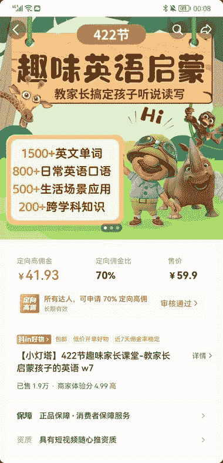

# 最近抖音无人动画直播火爆，大部分人都是做流量端，去赚取佣金

> 原文：[`www.yuque.com/for_lazy/xkrm14/gbegrfc2e5rzfbyk`](https://www.yuque.com/for_lazy/xkrm14/gbegrfc2e5rzfbyk)

作者： 米笠

日期：2022-12-26

点赞数：10

最近抖音无人动画直播火爆，大部分人都是做流量端，去赚取佣金。 站在平台的角度，流量价格非常划算。 思路： 小灯塔 APP，开了 70%的佣金给带货达人； 客户购买的英语动画，需要下载小灯塔 APP 观看。 等于给小灯塔 APP 做了免费的引流，后期的课程，都跟带货达人没有关系了。 这个流量思路可以嫁接给有能力开发其他高价产品的项目方。 例如：考公、考研、英语培训机构。知识付费低转高，把低价的课程都可以开 90 佣金让出去。

