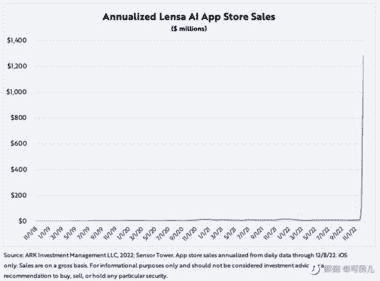

# Magic Avatar 推出的三周以来，Lensa AI 在 iOS 的年化收入增长了约 100X

> 原文：[`www.yuque.com/for_lazy/xkrm14/ao9yr10nz1gh8clt`](https://www.yuque.com/for_lazy/xkrm14/ao9yr10nz1gh8clt)

作者： 蓝弈

日期：2022-12-23

点赞数：15

自 Magic Avatar 推出的三周以来，Lensa AI 在 iOS 的年化收入增长了约 100X（从 1000 万美金到 12 亿美金），其中：日活增长了 37X，ARPU 增长了 3X。

[Artificial+Intelligence+Archives+-+ARK+Invest](https://ark-invest.com/search-tags/artificial-intelligence/)

