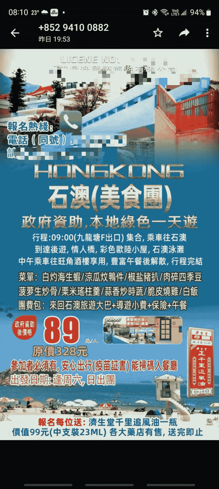

# 各地肯定要开始补贴旅游业，如果将这些信息整合，应该能吸引很多流量

> 原文：[`www.yuque.com/for_lazy/xkrm14/gnhzhr5nixl8kmkc`](https://www.yuque.com/for_lazy/xkrm14/gnhzhr5nixl8kmkc)

<ne-p id="u1579d411" data-lake-id="u1579d411"><ne-text id="u86c16a5d">作者： 福猫</ne-text></ne-p> <ne-p id="uf1d4287e" data-lake-id="uf1d4287e"><ne-text id="ud463b8b4">日期：2022-12-26</ne-text></ne-p> <ne-p id="ua9536906" data-lake-id="ua9536906"><ne-text id="ud51243d6">点赞数：</ne-text><ne-text id="u20bcc3fd" ne-bold="true">7</ne-text></ne-p> <ne-hole id="ub7659b55" data-lake-id="ub7659b55"><ne-card data-card-name="hr" data-card-type="block" id="nN55J" data-event-boundary="card"><ne-p id="u228e01fd" data-lake-id="u228e01fd"><ne-text id="uc49d48f6">后疫情时代已经来临，各地肯定要开始补贴旅游业，如果将这些信息整合，应该能吸引很多流量，以香港为例，香港政府补贴很多旅游团搞活动</ne-text></ne-p> <ne-p id="u5389111f" data-lake-id="u5389111f"><ne-card data-card-name="image" data-card-type="inline" id="agTqs" data-event-boundary="card"></ne-card></ne-p> <ne-hole id="ue1c3a2cb" data-lake-id="ue1c3a2cb"><ne-card data-card-name="hr" data-card-type="block" id="T4VE8" data-event-boundary="card"><ne-p id="u51583bb1" data-lake-id="u51583bb1"><ne-text id="u33aa2adf">公众号懒人找资源，懒人专属群分享</ne-text></ne-p></ne-card></ne-hole></ne-card></ne-hole>