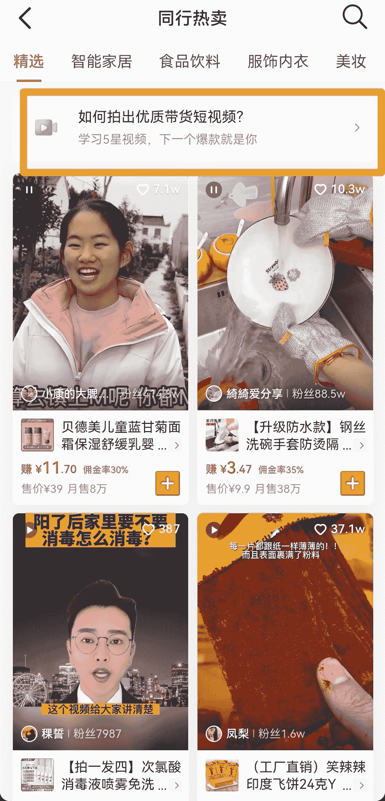
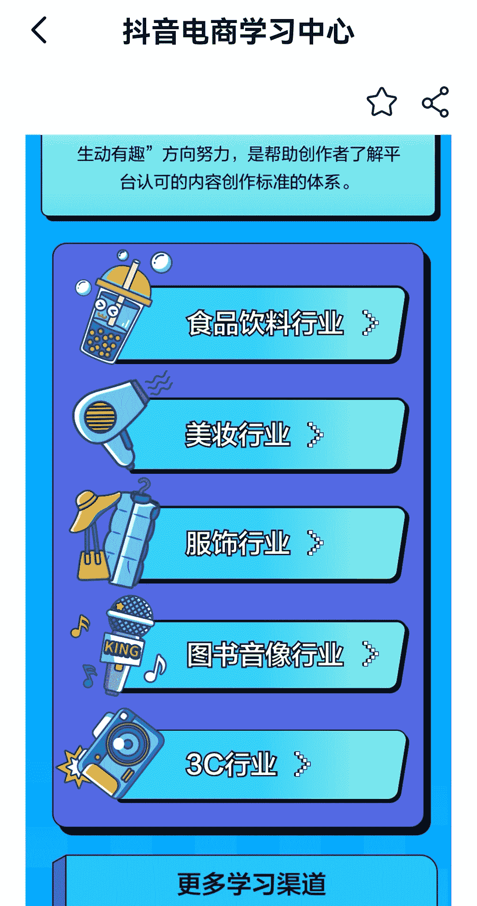

# 抖音“商品橱窗”里点击“成长训练营”，有详细的带货视频内容“星级标准”可参考

> 原文：[`www.yuque.com/for_lazy/xkrm14/pe0sw72m28nin5i8`](https://www.yuque.com/for_lazy/xkrm14/pe0sw72m28nin5i8)

<ne-p id="u4796d548" data-lake-id="u4796d548"><ne-text id="ucdd76fb1">作者： 麦麦芒</ne-text></ne-p> <ne-p id="uab133b1f" data-lake-id="uab133b1f"><ne-text id="u1bfa3940">日期：2022-12-28</ne-text></ne-p> <ne-p id="ud8dbb07a" data-lake-id="ud8dbb07a"><ne-text id="u5c55613a">点赞数：</ne-text><ne-text id="udc05fa6f" ne-bold="true">18</ne-text></ne-p> <ne-hole id="ua64f1901" data-lake-id="ua64f1901"><ne-card data-card-name="hr" data-card-type="block" id="hHxzQ" data-event-boundary="card"><ne-p id="uba43557c" data-lake-id="uba43557c"><ne-text id="ue2f25743">在抖音“商品橱窗”里点击“成长训练营”，👉点击“同行热卖”，会看到抖音官方的“内容分级”，里边会有详细的带货视频内容“星级标准”，可以参考一下，帮助我们提高带货视频的播放与转化</ne-text></ne-p> <ne-p id="u0b6c7c03" data-lake-id="u0b6c7c03"><ne-card data-card-name="image" data-card-type="inline" id="eLEkw" data-event-boundary="card"></ne-card></ne-p> <ne-p id="u8f4e4b50" data-lake-id="u8f4e4b50"><ne-card data-card-name="image" data-card-type="inline" id="rupy2" data-event-boundary="card"></ne-card></ne-p> <ne-p id="ud3f5bd07" data-lake-id="ud3f5bd07"><ne-card data-card-name="image" data-card-type="inline" id="Aogqx" data-event-boundary="card"></ne-card></ne-p> <ne-p id="ufb2de370" data-lake-id="ufb2de370"><ne-card data-card-name="image" data-card-type="inline" id="xt4kT" data-event-boundary="card"></ne-card></ne-p> <ne-p id="u591b9539" data-lake-id="u591b9539"><ne-card data-card-name="image" data-card-type="inline" id="pGdvp" data-event-boundary="card"></ne-card></ne-p> <ne-p id="u96d33900" data-lake-id="u96d33900"><ne-card data-card-name="image" data-card-type="inline" id="ZjZTF" data-event-boundary="card"></ne-card></ne-p> <ne-hole id="u2e2663b5" data-lake-id="u2e2663b5"><ne-card data-card-name="hr" data-card-type="block" id="JShyU" data-event-boundary="card"><ne-p id="uc1d6d69b" data-lake-id="uc1d6d69b"><ne-text id="u11afa8be">公众号懒人找资源，懒人专属群分享</ne-text></ne-p></ne-card></ne-hole></ne-card></ne-hole>