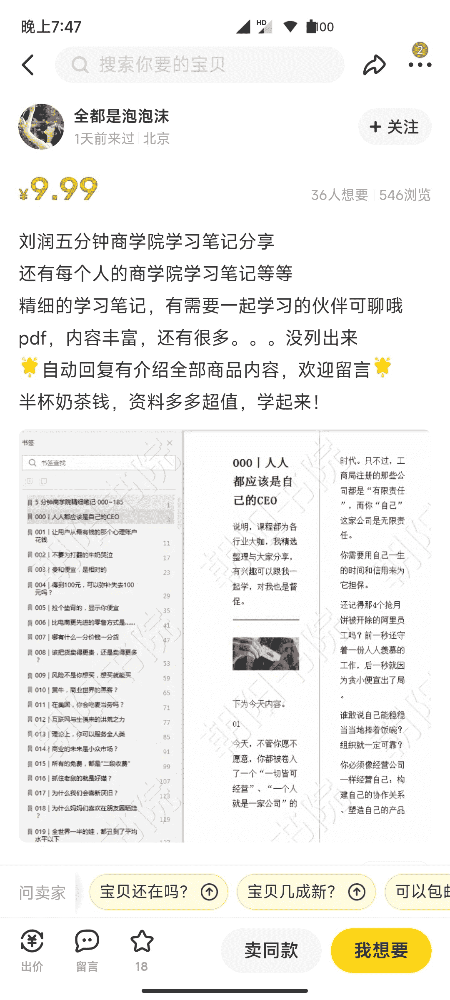
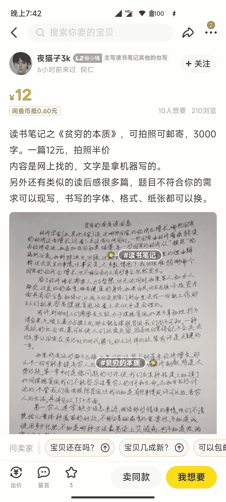

# 用读书笔记在咸鱼引流

> 原文：[`www.yuque.com/for_lazy/xkrm14/utzxg8yz233lkpar`](https://www.yuque.com/for_lazy/xkrm14/utzxg8yz233lkpar)

<ne-p id="u4d7afae9" data-lake-id="u4d7afae9"><ne-text id="u9f133e66">作者： 阿丰</ne-text></ne-p> <ne-p id="ub6f1bbfd" data-lake-id="ub6f1bbfd"><ne-text id="u13216f08">日期：2022-12-19</ne-text></ne-p> <ne-p id="u518a8c78" data-lake-id="u518a8c78"><ne-text id="u7e00a39a">点赞数：</ne-text><ne-text id="u64f3942e" ne-bold="true">23</ne-text></ne-p> <ne-hole id="u27c52a0c" data-lake-id="u27c52a0c"><ne-card data-card-name="hr" data-card-type="block" id="GpOyp" data-event-boundary="card"><ne-p id="u6de034d4" data-lake-id="u6de034d4"><ne-text id="u3c9452ae">用读书笔记在咸鱼引流</ne-text></ne-p> <ne-p id="u3ac4a046" data-lake-id="u3ac4a046"><ne-text id="udcea2139">很多人都知道咸鱼是个巨大的流量池，而热门书籍本身就自带热度。</ne-text></ne-p> <ne-p id="u6d8d54a8" data-lake-id="u6d8d54a8"><ne-text id="ucc0513c4">别人卖二手热门书，你卖读书笔记，价格可以设置很低，比如 1 到 5 块，这样通过价格排序就可以排在前面，同时用这个来引流。</ne-text></ne-p> <ne-p id="uec628293" data-lake-id="uec628293"><ne-text id="u6130625d">曝光量大、目标用户精准、排序有优势、引流效果杠杠的。</ne-text></ne-p> <ne-p id="u536183e0" data-lake-id="u536183e0"><ne-card data-card-name="image" data-card-type="inline" id="DuvZC" data-event-boundary="card"></ne-card></ne-p> <ne-p id="ub2f88aef" data-lake-id="ub2f88aef"><ne-card data-card-name="image" data-card-type="inline" id="hrGJr" data-event-boundary="card"></ne-card></ne-p> <ne-hole id="u73ba1981" data-lake-id="u73ba1981"><ne-card data-card-name="hr" data-card-type="block" id="BXA2G" data-event-boundary="card"><ne-p id="ue24f000a" data-lake-id="ue24f000a"><ne-text id="u78010749">公众号懒人找资源，懒人专属群分享</ne-text></ne-p></ne-card></ne-hole></ne-card></ne-hole>