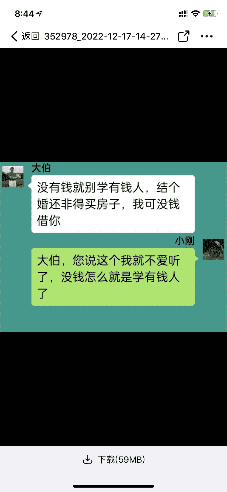
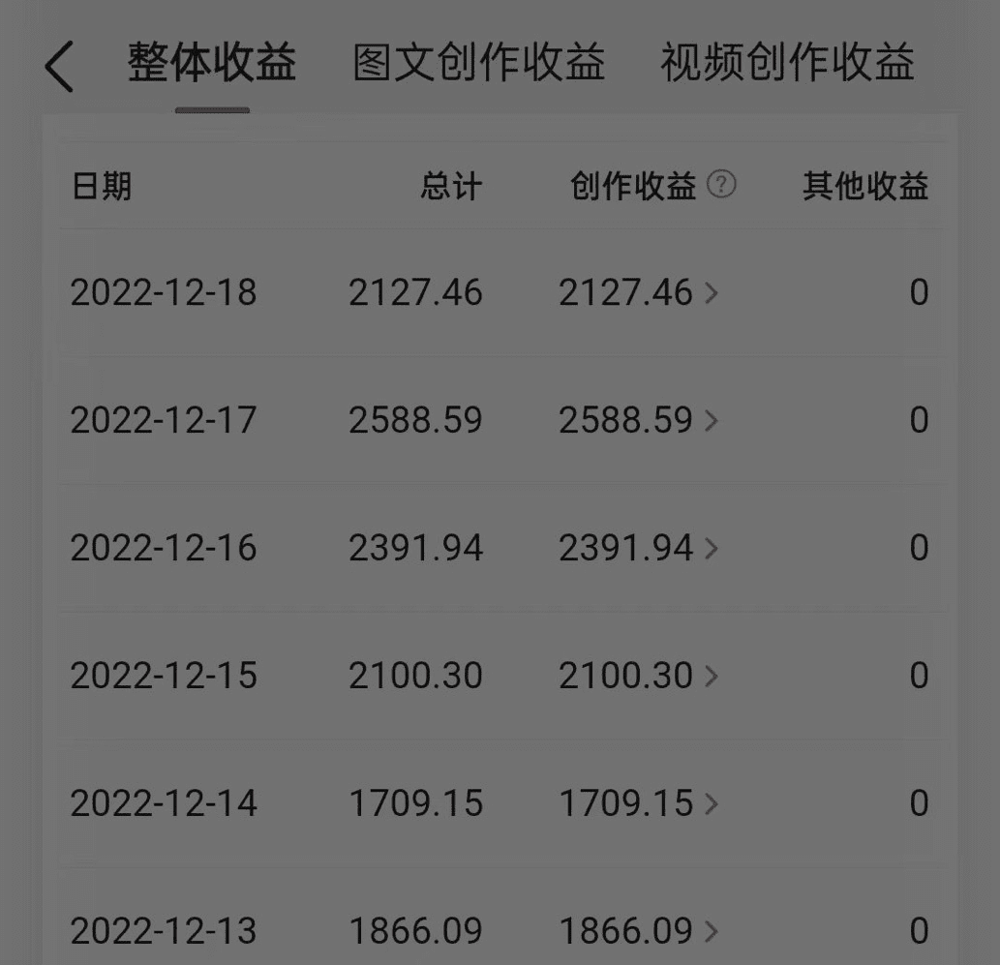
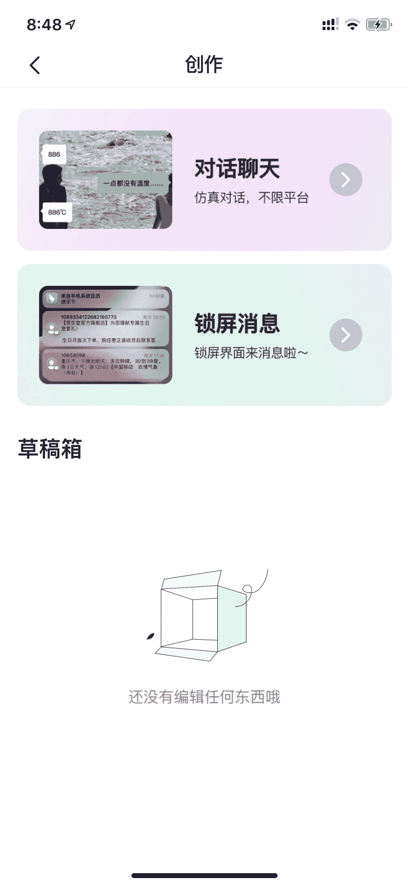

# 以聊天对话的形式展示内容，以家庭为主题的情感中视频完播率很高

> 原文：[`www.yuque.com/for_lazy/xkrm14/rp8pe8ggmyo4l4w6`](https://www.yuque.com/for_lazy/xkrm14/rp8pe8ggmyo4l4w6)

<ne-p id="u93ff74c2" data-lake-id="u93ff74c2"><ne-text id="ufebc4ec1">作者： 杨飞</ne-text></ne-p> <ne-p id="u1dea64c4" data-lake-id="u1dea64c4"><ne-text id="u64cd3aae">日期：2022-12-21</ne-text></ne-p> <ne-p id="ue5c0b38b" data-lake-id="ue5c0b38b"><ne-text id="u860992f8">点赞数：</ne-text><ne-text id="ue053c28a" ne-bold="true">25</ne-text></ne-p> <ne-hole id="ue0849cc3" data-lake-id="ue0849cc3"><ne-card data-card-name="hr" data-card-type="block" id="Q53k9" data-event-boundary="card"><ne-p id="ud5289495" data-lake-id="ud5289495"><ne-text id="u5d08342d">情感中视频</ne-text></ne-p> <ne-p id="ue42c7419" data-lake-id="ue42c7419"><ne-text id="udc9caac2">以聊天对话的形式展示内容，以家庭为主题，围绕婆媳关系、叔侄分家产、曲折婚姻等展开，很多四十岁以上的人就喜欢听这些小故事，这种作品亲测在抖音上数据挺不错的，完播率很高（边做饭边听），而且还能参加中视频赚钱！</ne-text></ne-p> <ne-p id="u0df981bb" data-lake-id="u0df981bb"><ne-text id="u320c2247">推荐两款软件：美册、剪同款</ne-text></ne-p> <ne-p id="ua6e15808" data-lake-id="ua6e15808"><ne-text id="uc6355426">直接把同行爆过的文案用轻抖提取出来，简单修改后，用软件生成即可！</ne-text></ne-p> <ne-p id="u858d1867" data-lake-id="u858d1867"><ne-text id="uc5434461">对了，这种视频还特别适合做小说推文项目的朋友，最后一张截图就是做的小说推广。</ne-text></ne-p> <ne-p id="ueafdb988" data-lake-id="ueafdb988"><ne-card data-card-name="image" data-card-type="inline" id="lOsuK" data-event-boundary="card"></ne-card></ne-p> <ne-p id="u004a1796" data-lake-id="u004a1796"><ne-card data-card-name="image" data-card-type="inline" id="pmC3u" data-event-boundary="card"></ne-card></ne-p> <ne-p id="uaa4fd8de" data-lake-id="uaa4fd8de"><ne-card data-card-name="image" data-card-type="inline" id="GHRR5" data-event-boundary="card"></ne-card></ne-p> <ne-p id="ue2121ef5" data-lake-id="ue2121ef5"><ne-card data-card-name="image" data-card-type="inline" id="RSXsp" data-event-boundary="card"></ne-card></ne-p> <ne-p id="u75043dbd" data-lake-id="u75043dbd"><ne-card data-card-name="image" data-card-type="inline" id="fwMAd" data-event-boundary="card"></ne-card></ne-p> <ne-p id="u1fb34cf4" data-lake-id="u1fb34cf4"><ne-card data-card-name="image" data-card-type="inline" id="bkM7H" data-event-boundary="card"></ne-card></ne-p> <ne-p id="u7c696dad" data-lake-id="u7c696dad"><ne-card data-card-name="image" data-card-type="inline" id="YGf8y" data-event-boundary="card"></ne-card></ne-p> <ne-p id="uce51c697" data-lake-id="uce51c697"><ne-card data-card-name="image" data-card-type="inline" id="VQhI2" data-event-boundary="card"></ne-card></ne-p> <ne-hole id="uaf377dbe" data-lake-id="uaf377dbe"><ne-card data-card-name="hr" data-card-type="block" id="QhyCR" data-event-boundary="card"><ne-p id="ue8aac8f8" data-lake-id="ue8aac8f8"><ne-text id="uda88c74c">公众号懒人找资源，懒人专属群分享</ne-text></ne-p></ne-card></ne-hole></ne-card></ne-hole>