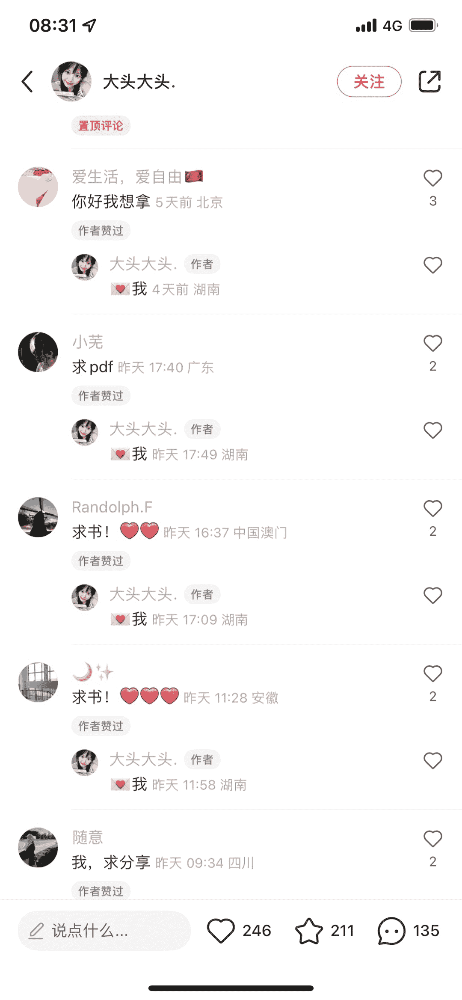
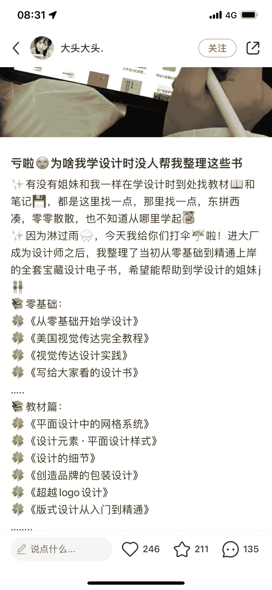

# 小红书上设计作品集的需求还蛮高的，做小红书虚拟资源的朋友可以做个这样的号

> 原文：[`www.yuque.com/for_lazy/xkrm14/elg4wn6gqfe95ggm`](https://www.yuque.com/for_lazy/xkrm14/elg4wn6gqfe95ggm)

作者： 钱劲

日期：2022-12-27

点赞数：12

<ne-card data-card-name="hr" data-card-type="block" id="uzrYQ" data-event-boundary="card">

小红书上设计作品集的需求还蛮高的，做小红书虚拟资源的朋友可以做个这样的号！

<ne-card data-card-name="image" data-card-type="inline" id="FNi4N" data-event-boundary="card"></ne-card>

<ne-card data-card-name="image" data-card-type="inline" id="hdD4W" data-event-boundary="card"></ne-card>

<ne-card data-card-name="image" data-card-type="inline" id="M9EPV" data-event-boundary="card"></ne-card>

<ne-card data-card-name="image" data-card-type="inline" id="xoffo" data-event-boundary="card"></ne-card>

<ne-card data-card-name="hr" data-card-type="block" id="VulLs" data-event-boundary="card">

公众号懒人找资源，懒人专属群分享

</ne-card></ne-card>