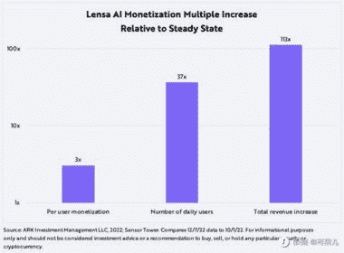

# Magic Avatar 推出的三周以来，Lensa AI 在 iOS 的年化收入增长了约 100X

> 原文：[`www.yuque.com/for_lazy/xkrm14/ao9yr10nz1gh8clt`](https://www.yuque.com/for_lazy/xkrm14/ao9yr10nz1gh8clt)

<ne-p id="u58d4529e" data-lake-id="u58d4529e"><ne-text id="ua2f5bd03">作者： 蓝弈</ne-text></ne-p> <ne-p id="ucbad2601" data-lake-id="ucbad2601"><ne-text id="u132c27ac">日期：2022-12-23</ne-text></ne-p> <ne-p id="ue5ad75c2" data-lake-id="ue5ad75c2"><ne-text id="u6e030018">点赞数：</ne-text><ne-text id="u64f29a5d" ne-bold="true">15</ne-text></ne-p> <ne-hole id="uc3bd1808" data-lake-id="uc3bd1808"><ne-card data-card-name="hr" data-card-type="block" id="FLRtS" data-event-boundary="card"><ne-p id="u00292d08" data-lake-id="u00292d08"><ne-text id="u53cb782a">自 Magic Avatar 推出的三周以来，Lensa AI 在 iOS 的年化收入增长了约 100X（从 1000 万美金到 12 亿美金），其中：日活增长了 37X，ARPU 增长了 3X。</ne-text></ne-p> <ne-p id="u91c3a962" data-lake-id="u91c3a962">[<ne-text id="u49f924b0">Artificial+Intelligence+Archives+-+ARK+Invest</ne-text>](https://ark-invest.com/search-tags/artificial-intelligence/)</ne-p> <ne-p id="u6ccbb52b" data-lake-id="u6ccbb52b"><ne-card data-card-name="image" data-card-type="inline" id="rVlgX" data-event-boundary="card"></ne-card></ne-p> <ne-p id="u613596e1" data-lake-id="u613596e1"><ne-card data-card-name="image" data-card-type="inline" id="oMTED" data-event-boundary="card"></ne-card></ne-p> <ne-hole id="u40328914" data-lake-id="u40328914"><ne-card data-card-name="hr" data-card-type="block" id="Q99ef" data-event-boundary="card"><ne-p id="ubcb6d29b" data-lake-id="ubcb6d29b"><ne-text id="u5bf8483e">公众号懒人找资源，懒人专属群分享</ne-text></ne-p></ne-card></ne-hole></ne-card></ne-hole>