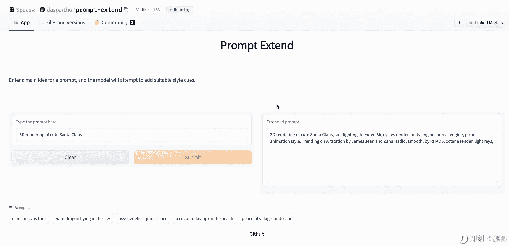

# AI 帮助生成 AI 提示词的功能终于有人产品化了

> 原文：[`www.yuque.com/for_lazy/xkrm14/ylyiiottvelkvlgk`](https://www.yuque.com/for_lazy/xkrm14/ylyiiottvelkvlgk)

作者： 臻默

日期：2022-12-22

点赞数：28

<ne-card data-card-name="hr" data-card-type="block" id="DZT56" data-event-boundary="card">

之前设想过的 AI 帮助生成 AI 提示词的功能终于有人产品化了。 你只需要输入一个 AI 绘图提示的主旨，这个模型将尝试帮你添加合适的风格提示。 下面的后面两张图是我试用的结果，效果挺好的。  [Prompt+Extend+-+a+Hugging+Face+Space+by+daspartho](https://huggingface.co/spaces/daspartho/prompt-extend)

<ne-card data-card-name="image" data-card-type="inline" id="RG8pt" data-event-boundary="card"></ne-card>

<ne-card data-card-name="image" data-card-type="inline" id="YC2qP" data-event-boundary="card"></ne-card>

<ne-card data-card-name="image" data-card-type="inline" id="cBPDL" data-event-boundary="card"></ne-card>

<ne-card data-card-name="hr" data-card-type="block" id="nyMeQ" data-event-boundary="card">

公众号懒人找资源，懒人专属群分享

</ne-card></ne-card>