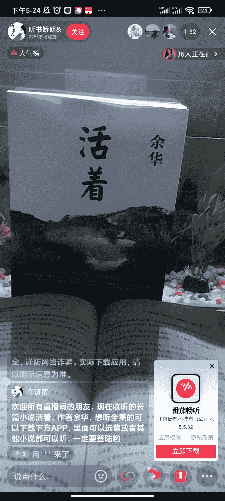

# 抖音直播引导下载番茄畅听，赚拉新的钱

> 原文：[`www.yuque.com/for_lazy/xkrm14/cutausdl21r1plv5`](https://www.yuque.com/for_lazy/xkrm14/cutausdl21r1plv5)

<ne-p id="uadff06bb" data-lake-id="uadff06bb"><ne-text id="u446ae43f">作者： 清晨</ne-text></ne-p> <ne-p id="uabd17175" data-lake-id="uabd17175"><ne-text id="ufbe0dd87">日期：2022-12-22</ne-text></ne-p> <ne-p id="u8d2f0842" data-lake-id="u8d2f0842"><ne-text id="u9534408c">点赞数：</ne-text><ne-text id="uae9aac4b" ne-bold="true">20</ne-text></ne-p> <ne-hole id="u28729e40" data-lake-id="u28729e40"><ne-card data-card-name="hr" data-card-type="block" id="i676L" data-event-boundary="card"><ne-p id="udf3b8b26" data-lake-id="udf3b8b26"><ne-text id="u1c1ae31e">抖音直播引导下载  番茄畅听  赚拉新的钱</ne-text></ne-p> <ne-p id="ud47ad2a0" data-lake-id="ud47ad2a0"><ne-card data-card-name="image" data-card-type="inline" id="OyFbM" data-event-boundary="card"></ne-card></ne-p> <ne-hole id="ud41f9ac4" data-lake-id="ud41f9ac4"><ne-card data-card-name="hr" data-card-type="block" id="uceUd" data-event-boundary="card"><ne-p id="u30902f51" data-lake-id="u30902f51"><ne-text id="u87c8c154">公众号懒人找资源，懒人专属群分享</ne-text></ne-p></ne-card></ne-hole></ne-card></ne-hole>