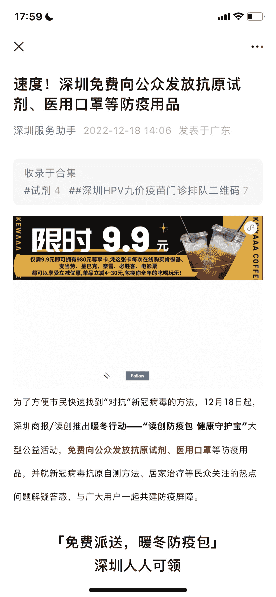
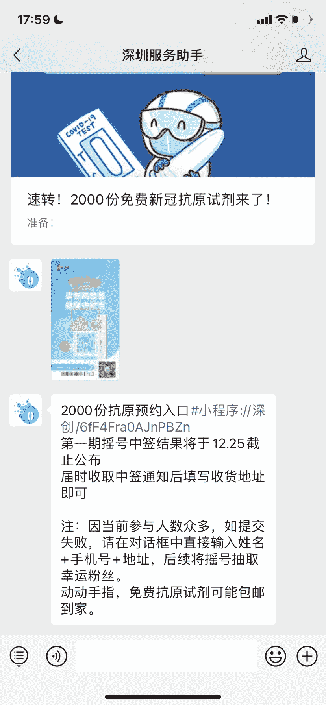

# 分享一个公众号引流案例

> 原文：[`www.yuque.com/for_lazy/xkrm14/tz3fwehqngrqclyh`](https://www.yuque.com/for_lazy/xkrm14/tz3fwehqngrqclyh)

<ne-p id="ua2ded53a" data-lake-id="ua2ded53a"><ne-text id="u16b7bc40">作者： 小夏</ne-text></ne-p> <ne-p id="u7e71cfa1" data-lake-id="u7e71cfa1"><ne-text id="u84f87cbf">日期：2022-12-19</ne-text></ne-p> <ne-p id="ufdb86ca8" data-lake-id="ufdb86ca8"><ne-text id="u959f736d">点赞数：</ne-text><ne-text id="u3280da66" ne-bold="true">27</ne-text></ne-p> <ne-hole id="ub338080a" data-lake-id="ub338080a"><ne-card data-card-name="hr" data-card-type="block" id="qJrY7" data-event-boundary="card"><ne-p id="u1c18db6b" data-lake-id="u1c18db6b"><ne-text id="ub6415222">公众号引流案例，看了一下账号主体，不是政府的，而且一家普通的私营企业，这个引流操作有点骚，不知道“刑不刑”。</ne-text></ne-p> <ne-p id="uedfb9964" data-lake-id="uedfb9964"><ne-card data-card-name="image" data-card-type="inline" id="xhbHm" data-event-boundary="card"></ne-card></ne-p> <ne-p id="uace0303c" data-lake-id="uace0303c"><ne-card data-card-name="image" data-card-type="inline" id="v0dtI" data-event-boundary="card"></ne-card></ne-p> <ne-hole id="u35dac69f" data-lake-id="u35dac69f"><ne-card data-card-name="hr" data-card-type="block" id="ClY9E" data-event-boundary="card"><ne-p id="u8ee74862" data-lake-id="u8ee74862"><ne-text id="uf04ce43b">公众号懒人找资源，懒人专属群分享</ne-text></ne-p></ne-card></ne-hole></ne-card></ne-hole>