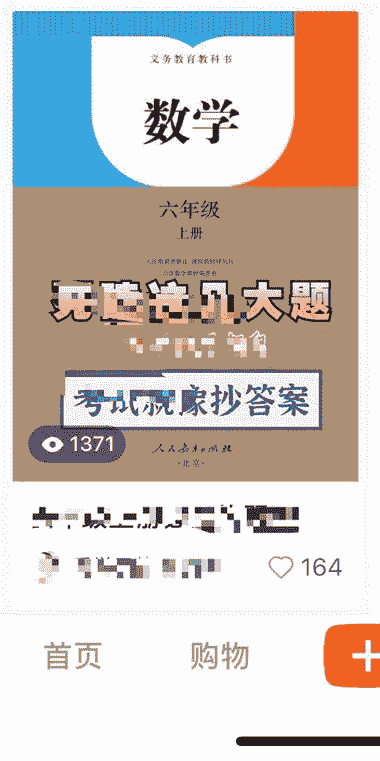

# 有一个作品在小红书中爆了就可以去多发同一个作品，做 IP 的不适用

> 原文：[`www.yuque.com/for_lazy/xkrm14/cv10ow6gavf6y4vu`](https://www.yuque.com/for_lazy/xkrm14/cv10ow6gavf6y4vu)

<ne-p id="u7c0a29b1" data-lake-id="u7c0a29b1"><ne-text id="uf269b851">作者： 小攀师兄</ne-text></ne-p> <ne-p id="ud96dbe6a" data-lake-id="ud96dbe6a"><ne-text id="u82e3d121">日期：2022-12-19</ne-text></ne-p> <ne-p id="u756b80fd" data-lake-id="u756b80fd"><ne-text id="u8e8c61de">点赞数：</ne-text><ne-text id="u58def096" ne-bold="true">17</ne-text></ne-p> <ne-hole id="ub2c5e0af" data-lake-id="ub2c5e0af"><ne-card data-card-name="hr" data-card-type="block" id="dECYW" data-event-boundary="card"><ne-p id="u0197974e" data-lake-id="u0197974e"><ne-text id="uce393a7b">你有一个作品在小红书中爆了就可以去多发同一个作品，做到再爆，直到把流量给薅完，还可以尝试找到其他的爆款~</ne-text></ne-p> <ne-p id="u11f8db7e" data-lake-id="u11f8db7e"><ne-text id="ub3976c4f">做个人 ip 的就没必要吧，我们就是通过这个东西去不断地薅流量，可以去试试</ne-text></ne-p> <ne-p id="ucfc25484" data-lake-id="ucfc25484"><ne-card data-card-name="image" data-card-type="inline" id="nAM8R" data-event-boundary="card"></ne-card></ne-p> <ne-p id="ub726a707" data-lake-id="ub726a707"><ne-card data-card-name="image" data-card-type="inline" id="SglyH" data-event-boundary="card"></ne-card></ne-p> <ne-p id="u4957b7df" data-lake-id="u4957b7df"><ne-card data-card-name="image" data-card-type="inline" id="uCCgX" data-event-boundary="card"></ne-card></ne-p> <ne-hole id="u8ac6c315" data-lake-id="u8ac6c315"><ne-card data-card-name="hr" data-card-type="block" id="BqT19" data-event-boundary="card"><ne-p id="u87efc699" data-lake-id="u87efc699"><ne-text id="u0e0379fc">公众号懒人找资源，懒人专属群分享</ne-text></ne-p></ne-card></ne-hole></ne-card></ne-hole>