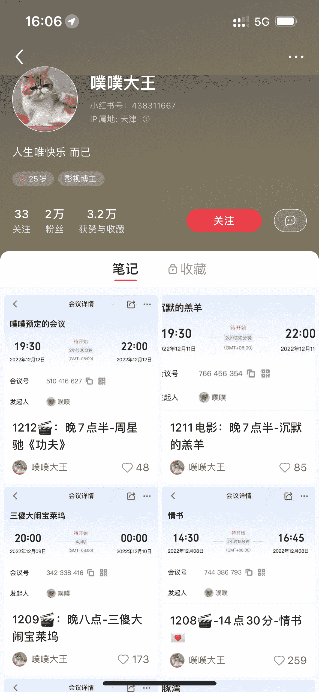

# 小红书上发现一种没见过的引流模式：通过线上观影拉人进腾讯会议

> 原文：[`www.yuque.com/for_lazy/xkrm14/qeoa1x2rbuldmpm2`](https://www.yuque.com/for_lazy/xkrm14/qeoa1x2rbuldmpm2)

<ne-p id="u4114bf57" data-lake-id="u4114bf57"><ne-text id="u3dad9bca">作者： 某人周</ne-text></ne-p> <ne-p id="uad9545cb" data-lake-id="uad9545cb"><ne-text id="ue1af218f">日期：2022-12-19</ne-text></ne-p> <ne-p id="ud583b75d" data-lake-id="ud583b75d"><ne-text id="ubfe69397">点赞数：</ne-text><ne-text id="ud32483fd" ne-bold="true">26</ne-text></ne-p> <ne-hole id="u529dfd65" data-lake-id="u529dfd65"><ne-card data-card-name="hr" data-card-type="block" id="ZVRR6" data-event-boundary="card"><ne-p id="u43854ee7" data-lake-id="u43854ee7"><ne-text id="u1935c3c4">在小红书上发现一种没见过的引流模式：通过线上观影拉人进腾讯会议。</ne-text></ne-p> <ne-p id="u234adedd" data-lake-id="u234adedd"><ne-text id="ua83e9a5a">突出一个真诚，电影是豆瓣排行榜比较靠前的精品，会议号直接放出来不怕违规。</ne-text></ne-p> <ne-p id="ubffafab3" data-lake-id="ubffafab3"><ne-text id="u52adcd30">看电影的时候忘了截图了[捂脸] 看电影大家都没开摄像头，人均社恐，电影就是网上找的资源，搜磁力链接就有的那种，开头和结尾会放微信号拉群，以便约下次看电影的时间和选电影。</ne-text></ne-p> <ne-p id="ud8302bcf" data-lake-id="ud8302bcf"><ne-text id="u2e7ad8ed">可以推广到其他平台比如豆瓣，抖音，最右，引流来的目测是年轻人，但标签不怎么精准，优质电影的受众太广了。</ne-text></ne-p> <ne-p id="uc239942c" data-lake-id="uc239942c"><ne-card data-card-name="image" data-card-type="inline" id="owMBT" data-event-boundary="card"></ne-card></ne-p> <ne-p id="u217a5ed8" data-lake-id="u217a5ed8"><ne-card data-card-name="image" data-card-type="inline" id="yHC3B" data-event-boundary="card"></ne-card></ne-p> <ne-hole id="ufdbc6ee7" data-lake-id="ufdbc6ee7"><ne-card data-card-name="hr" data-card-type="block" id="oYwgG" data-event-boundary="card"><ne-p id="u529f48e8" data-lake-id="u529f48e8"><ne-text id="uf849107d">公众号懒人找资源，懒人专属群分享</ne-text></ne-p></ne-card></ne-hole></ne-card></ne-hole>