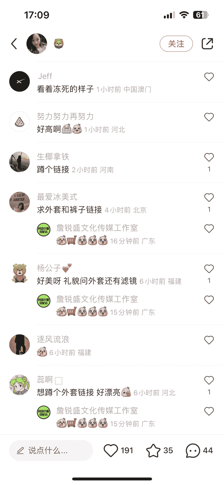
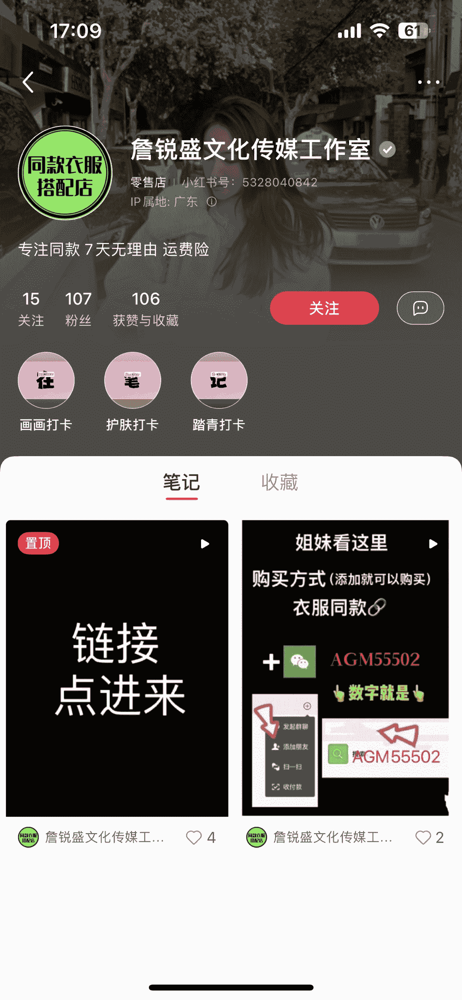

# 在小红书穿衣搭配的评论内容中，回复“求衣服链接”用户，引流到个人主页

> 原文：[`www.yuque.com/for_lazy/xkrm14/xsqwar1nm6vykytr`](https://www.yuque.com/for_lazy/xkrm14/xsqwar1nm6vykytr)

作者： Sunwei

日期：2022-12-19

点赞数：16

<ne-hole id="u6e932e27" data-lake-id="u6e932e27"><ne-card data-card-name="hr" data-card-type="block" id="SYDIZ" data-event-boundary="card">

在小红书穿衣搭配的评论内容中，回复“求衣服链接”用户，引流到个人主页进而加到私域成交 优势：精准女装用户，商品明确（可淘宝以图搜图），引到私域还能二次转化

<ne-card data-card-name="image" data-card-type="inline" id="td102" data-event-boundary="card"></ne-card>

<ne-card data-card-name="image" data-card-type="inline" id="J4Hz8" data-event-boundary="card"></ne-card>

<ne-hole id="udc0c3fb9" data-lake-id="udc0c3fb9"><ne-card data-card-name="hr" data-card-type="block" id="lWvLE" data-event-boundary="card">

公众号懒人找资源，懒人专属群分享

</ne-card></ne-hole></ne-card></ne-hole>