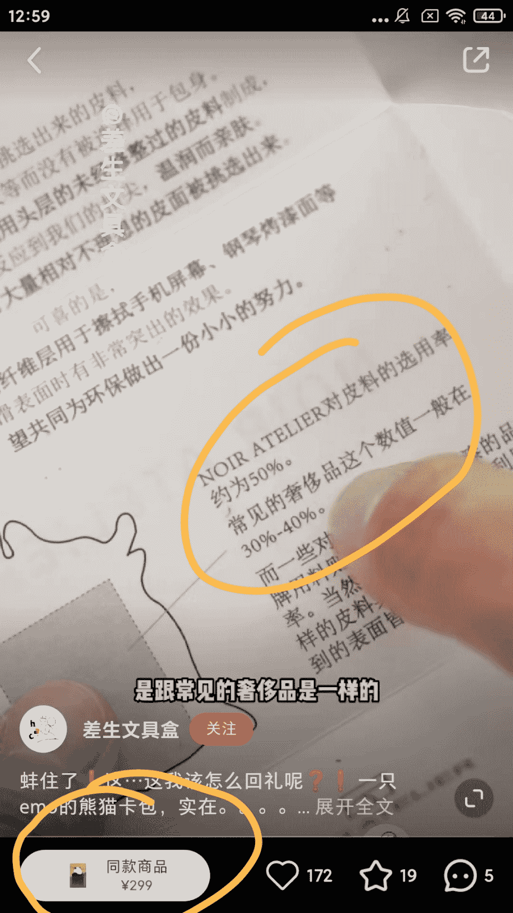
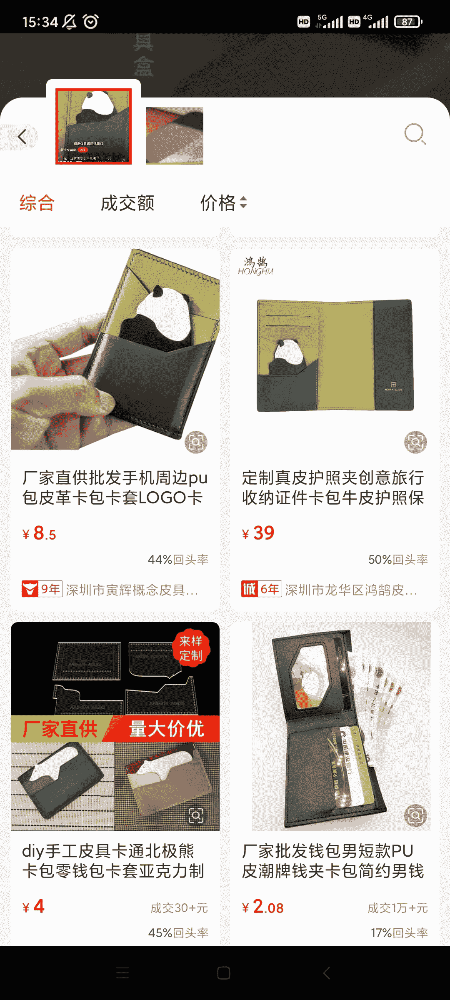

# 小红书短视频种草带货方法——粉丝送了我这个，怎么回礼？

> 原文：[`www.yuque.com/for_lazy/xkrm14/sdnrwze0i81qwb6r`](https://www.yuque.com/for_lazy/xkrm14/sdnrwze0i81qwb6r)

作者： 阿黎

日期：2022-12-23

点赞数：41

小红书短视频种草带货方法——粉丝送了我这个，怎么回礼？然后视频附上店铺链接，同款可拍(图 1-3) 视频卖 299，我去 1688 找了同款卖 8.5 到 40 左右(图 4)

玩法: 粉丝送礼，我如何回，你们帮我出主意 1.吸引好奇的人进来 2.埋下互动点，我怎么回礼——触发评论，然后获得系统推流 3.种草，店铺附上视频同款 4.增加一些材质高档、情怀、故事，提高客单价 ——我的思考，如果是我，我会搞多几个矩阵，开几个话题，比如 从闺蜜那抢的给她回礼送什么， 前男友送的，你们说我要不要收下， 想辞职了，老板团建每人送了这个，你们说要不要留下， 之类 结合圣诞、元旦、新年，送礼热点 也可以结合，婚礼答谢礼，同学毕业礼物之类人群

公众号懒人找资源，懒人专属群分享

