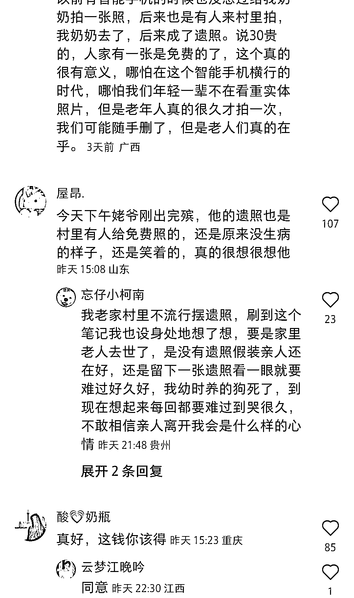

# 小红书免费给老人拍照赚钱案例

> 原文：[`www.yuque.com/for_lazy/xkrm14/znftzau7ixpvv00o`](https://www.yuque.com/for_lazy/xkrm14/znftzau7ixpvv00o)

作者： 大西 CC 

日期：2023-02-03 

点赞数：44 

过年在老家给老人拍照，赚了一万块 在小红书上看到这个博主的赚钱思路，挺有意思的，而且评论区里一水好评。 商业模式很简单：免费给村委会广场的老人拍照，多选一张收 30，还塑封。 选址很好，在村委会广场，人流足够多。 人群很精准，村委会一般老人多。 算了一下，10000 也就是三百多人，如果七天里每天拍 50 个人，加上有一些是多洗照片或者送给老伴儿、朋友，那利润也不错。 适合：懂点人像摄影的个体，赚点小钱，或者当地照相馆的人拍照，引流到实体店。 

 

 

