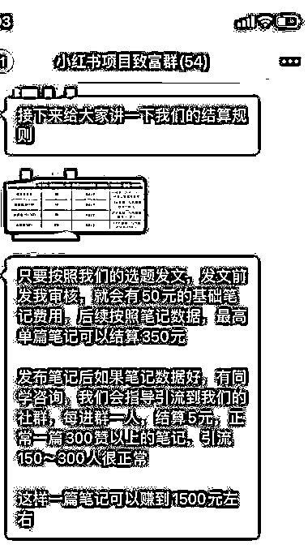

# 小红书媒介生意的落地实操

> 原文：[`www.yuque.com/for_lazy/xkrm14/gv648pv9h67hae65`](https://www.yuque.com/for_lazy/xkrm14/gv648pv9h67hae65)

作者： 不重要的 NPC 

日期：2023-02-02 

点赞数：15 

小红书媒介生意的落地实操，作为媒介帮助实体商家在小红书运营社群招募培训小红书运营若干，集中发布任务和奖励制度，利用实体商家每个月的预算奖励云运营，赚差价[得意] 

 

 

 

