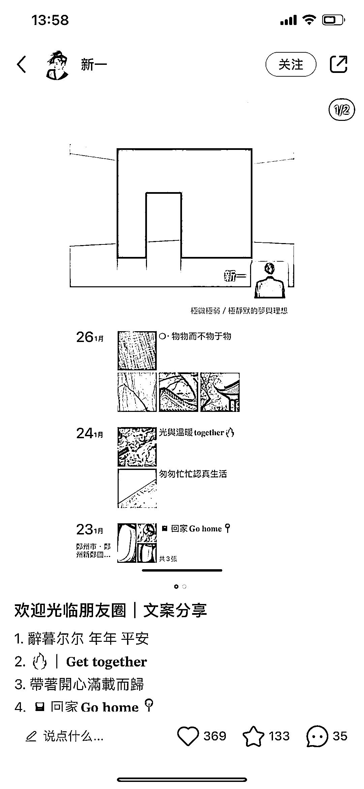
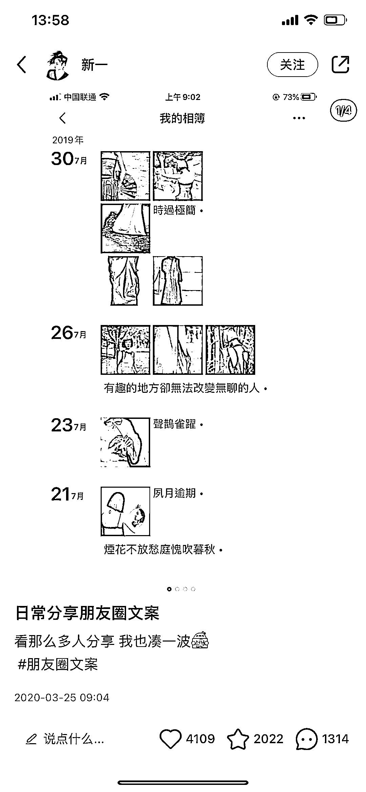
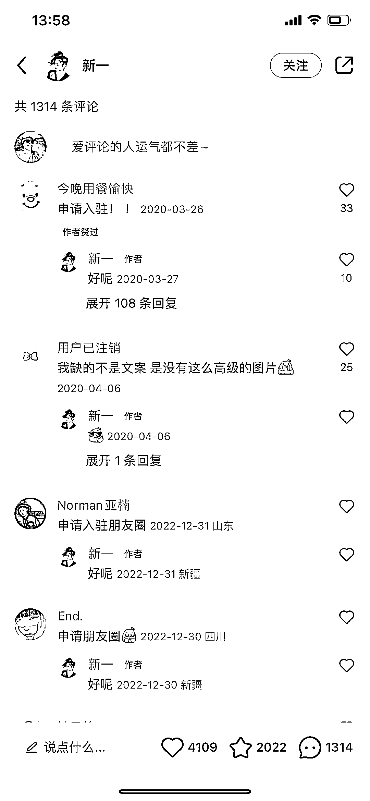

# 小红书利用朋友圈配图，引流私域

> 原文：[`www.yuque.com/for_lazy/xkrm14/ao3uvutbs0toh8z0`](https://www.yuque.com/for_lazy/xkrm14/ao3uvutbs0toh8z0)

作者： 钱劲 

日期：2023-02-01 

点赞数：6 

小红书引流微信方法：可以像截图这样，利用朋友圈配图文案来吸引人，看评论需求挺大的，都主动要加微信！ 微信加满了人就有很多种方法变现了。 

 

 

 

 

 

