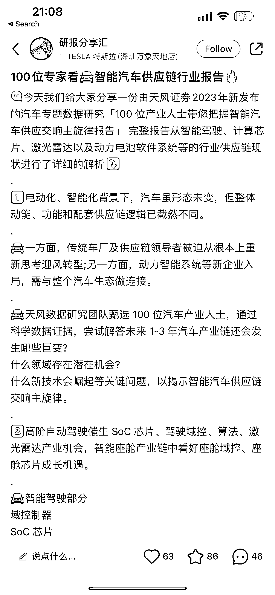
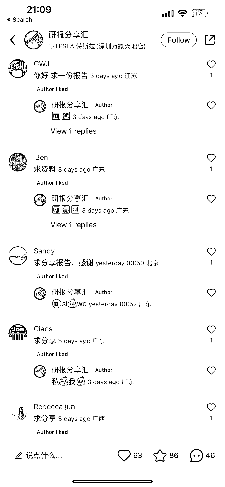
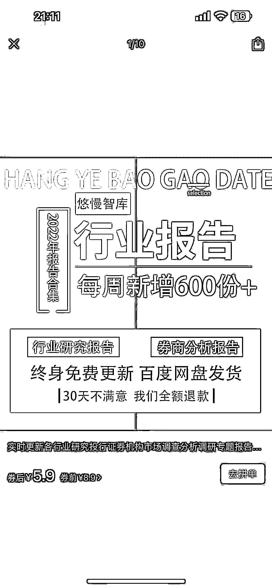

# 通过小红书，引流私域卖研报，赚信息差

> 原文：[`www.yuque.com/for_lazy/xkrm14/gczle0c10rlqg9r2`](https://www.yuque.com/for_lazy/xkrm14/gczle0c10rlqg9r2)

作者： 橙 Sir 

日期：2023-01-31 

点赞数：38 

通过小红书，引流私域卖研报，研报来源可以是拼多多，赚信息差且一份资料卖多人的钱。 

 

 

 

