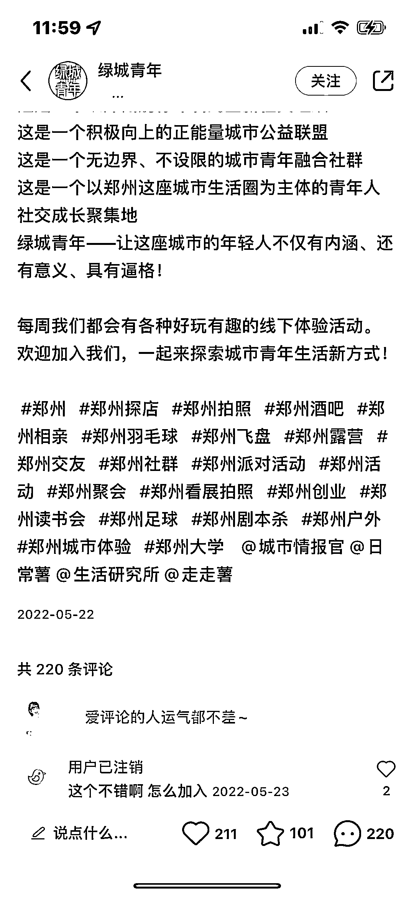

# 小红书笔记，建立本地生活交流圈

> 原文：[`www.yuque.com/for_lazy/xkrm14/srn130aykqqdkmkp`](https://www.yuque.com/for_lazy/xkrm14/srn130aykqqdkmkp)

作者： 张义维 

日期：2023-01-31 

点赞数：19 

发现这种特别吸引人。 可以建建一个当地的交流圈，生财有术线下版。 还可以其他品类，线下演讲圈，线下读书会， 我去年去了杭州去了上海参加生财夜话， 每次收获都很大，但需要跑很远。 面对面见面 ，比线上交流更刚需，收获更大，需求更大。 

 

 

 

 

