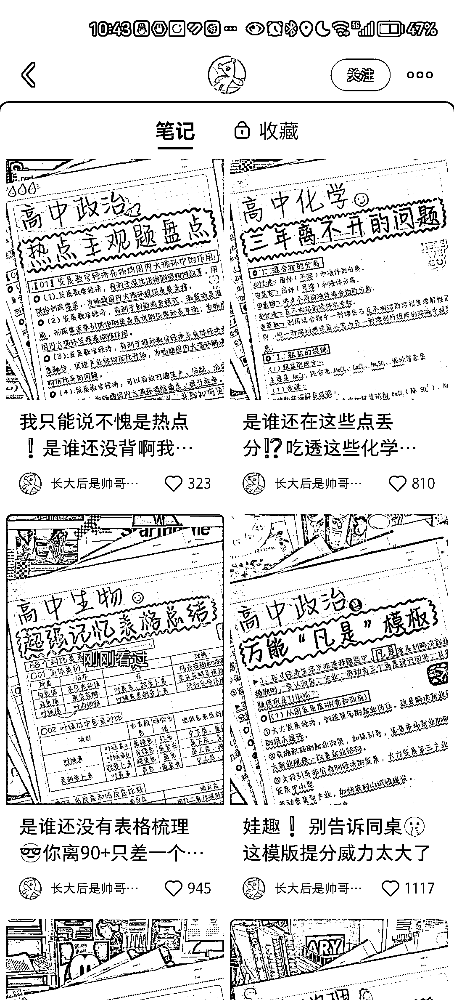

# 小红书手写笔记容易爆

> 原文：[`www.yuque.com/for_lazy/xkrm14/mb0u2pbuwn39ocfq`](https://www.yuque.com/for_lazy/xkrm14/mb0u2pbuwn39ocfq)

<ne-p id="u7d8e2ea7" data-lake-id="u7d8e2ea7"><ne-text id="u94728227">作者： 拱卒</ne-text></ne-p> <ne-p id="uc8a0b206" data-lake-id="uc8a0b206"><ne-text id="u10e26761">日期：2023-01-31</ne-text></ne-p> <ne-p id="u23aa93fd" data-lake-id="u23aa93fd"><ne-text id="u43cae77e">点赞数：</ne-text><ne-text id="ud06b8b45" ne-bold="true">18</ne-text></ne-p> <ne-hole id="uf1fba59f" data-lake-id="uf1fba59f"><ne-card data-card-name="hr" data-card-type="block" id="I5EtF" data-event-boundary="card"><ne-p id="u848c900a" data-lake-id="u848c900a"><ne-text id="uffab646f">这种精致的仿手写或者纯粹的素人手写笔记，很容易爆</ne-text></ne-p> <ne-p id="u41a12083" data-lake-id="u41a12083"><ne-card data-card-name="image" data-card-type="inline" id="ZnoBy" data-event-boundary="card"></ne-card></ne-p> <ne-hole id="u4b597c88" data-lake-id="u4b597c88"><ne-card data-card-name="hr" data-card-type="block" id="khUFO" data-event-boundary="card"><ne-p id="u30e253b7" data-lake-id="u30e253b7"><ne-text id="ue0471b10">公众号懒人找资源，懒人专属群分享</ne-text></ne-p></ne-card></ne-hole></ne-card></ne-hole>