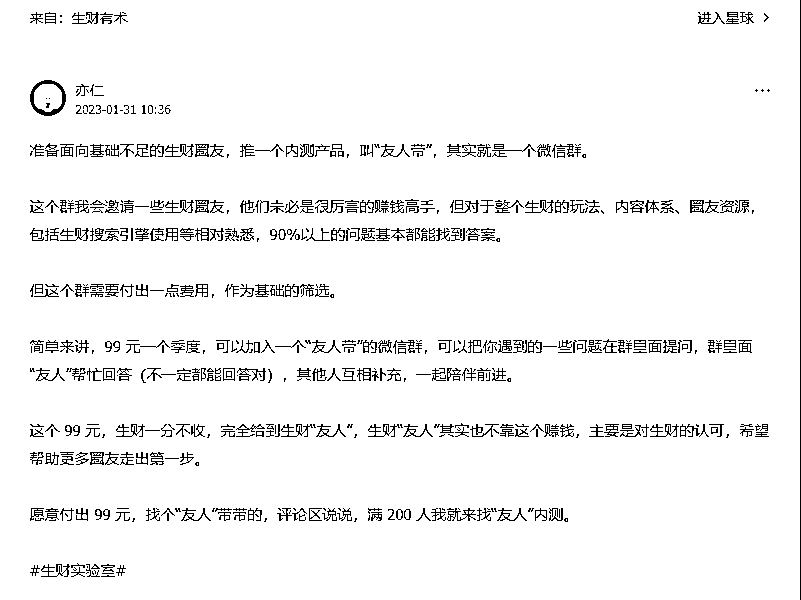

# “友人带”行业微信群玩法分析

> 原文：[`www.yuque.com/for_lazy/xkrm14/bq8kqkl4hggz8oho`](https://www.yuque.com/for_lazy/xkrm14/bq8kqkl4hggz8oho)

作者： 老彭 

日期：2023-01-31 

点赞数：25 

刚看到亦仁老大发的一条内容，推出“友人带”这款内测产品。 感觉这种内测玩法“微信群”，可以延伸到各行各业，作为最小产品切入，比如做穿搭博主的，也可以做一份“友人带”，他肯定认识一些同行穿搭博主，可以邀请进群（他们未必是很厉害的穿搭高手，但对于穿搭有自己的想法和独特见解 xxx 的），内容形式差不多，主要就是“赚钱”主题换成“穿搭”。 

  

