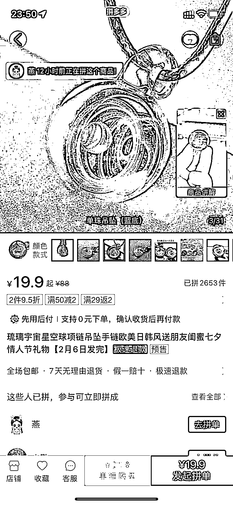
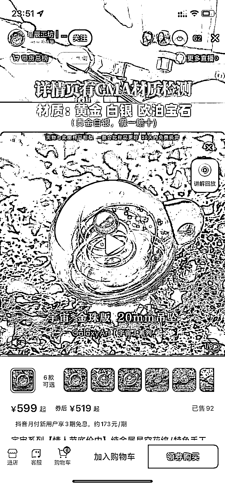
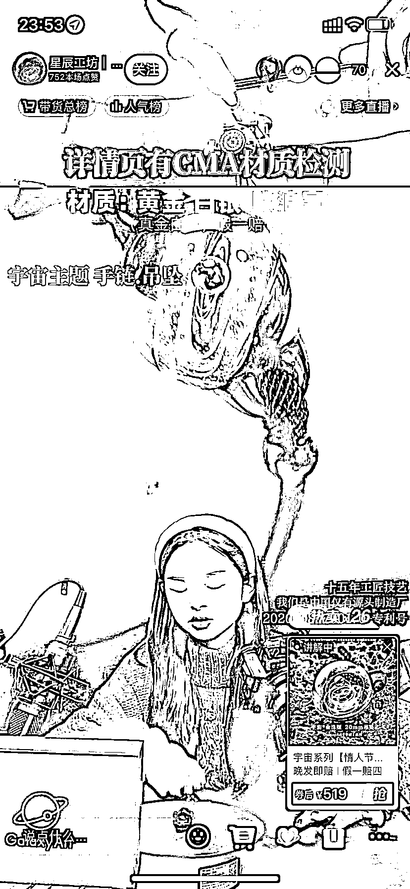

# 抖音电商选品与拼多多信息差

> 原文：[`www.yuque.com/for_lazy/xkrm14/pchhi5qkomcn7pz3`](https://www.yuque.com/for_lazy/xkrm14/pchhi5qkomcn7pz3)

<ne-p id="ueb7a0fe0" data-lake-id="ueb7a0fe0"><ne-text id="u4d886616">作者： 太波</ne-text></ne-p> <ne-p id="ude0e335e" data-lake-id="ude0e335e"><ne-text id="u21450fc5">日期：2023-02-02</ne-text></ne-p> <ne-p id="ub7a64a49" data-lake-id="ub7a64a49"><ne-text id="u05901109">点赞数：</ne-text><ne-text id="u06e3a5a0" ne-bold="true">43</ne-text></ne-p> <ne-hole id="u1284037f" data-lake-id="u1284037f"><ne-card data-card-name="hr" data-card-type="block" id="WhLL2" data-event-boundary="card"><ne-p id="ue3a57bba" data-lake-id="ue3a57bba"><ne-text id="ua465f9b1">拼夕夕 20 块钱的星空珠，抖音直播卖 500，后面背景循环播放制作视频，卖了不少，纯利润，我搜了一下卖这个的很少</ne-text></ne-p> <ne-p id="u05908b99" data-lake-id="u05908b99"><ne-card data-card-name="image" data-card-type="inline" id="cIAod" data-event-boundary="card"></ne-card></ne-p> <ne-p id="ue67ae4ec" data-lake-id="ue67ae4ec"><ne-card data-card-name="image" data-card-type="inline" id="Er5Cz" data-event-boundary="card"></ne-card></ne-p> <ne-p id="u8fa348c9" data-lake-id="u8fa348c9"><ne-card data-card-name="image" data-card-type="inline" id="yO2RO" data-event-boundary="card"></ne-card></ne-p> <ne-p id="ue5b4784f" data-lake-id="ue5b4784f"><ne-card data-card-name="image" data-card-type="inline" id="xpD0v" data-event-boundary="card"></ne-card></ne-p> <ne-hole id="u38f2666b" data-lake-id="u38f2666b"><ne-card data-card-name="hr" data-card-type="block" id="M6T0x" data-event-boundary="card"><ne-p id="ue10ecc19" data-lake-id="ue10ecc19"><ne-text id="u4fe10d61">公众号懒人找资源，懒人专属群分享</ne-text></ne-p></ne-card></ne-hole></ne-card></ne-hole>