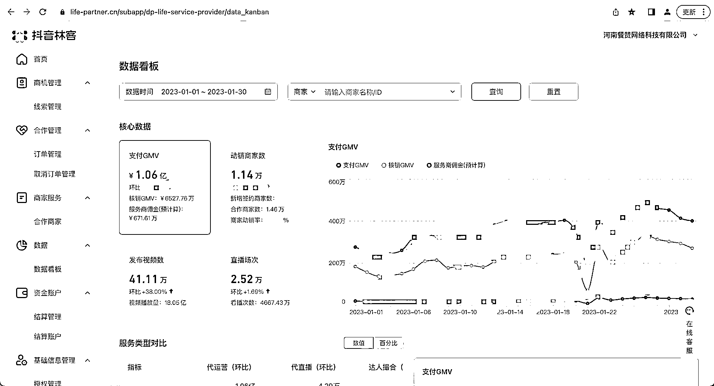

# 抖音来客服务商申请地址 “抖音林客”

> 原文：[`www.yuque.com/for_lazy/xkrm14/ikvp7mpvp0bv3ykq`](https://www.yuque.com/for_lazy/xkrm14/ikvp7mpvp0bv3ykq)

<ne-p id="uf3bb294a" data-lake-id="uf3bb294a"><ne-text id="u87eafaf7">作者： 闪电兄</ne-text></ne-p> <ne-p id="u657eabf0" data-lake-id="u657eabf0"><ne-text id="u9da7afe4">日期：2023-01-31</ne-text></ne-p> <ne-p id="u2e703d54" data-lake-id="u2e703d54"><ne-text id="u50c77587">点赞数：</ne-text><ne-text id="uea2e59c0" ne-bold="true">3</ne-text></ne-p> <ne-hole id="u5e92ad3b" data-lake-id="u5e92ad3b"><ne-card data-card-name="hr" data-card-type="block" id="o6tZc" data-event-boundary="card"><ne-p id="u7bfb6b6a" data-lake-id="u7bfb6b6a"><ne-text id="ud3314c18">今天看到的一个抖音来客的服务商 1 月份的业绩，预计佣金有 600 万，非常的令我惊讶，因为这个项目是我看着他从去年下半年开始运营，没想到抖音来客市场增长的如此之快。如果想做抖音来客服务商的可以到这里申请</ne-text> <ne-text id="u635b9692">“抖音林客”</ne-text>[<ne-text id="u0c375512">抖音林客｜抖音生活服务服务商平台</ne-text>](https://www.life-partner.cn/)</ne-p> <ne-p id="udba61ba5" data-lake-id="udba61ba5"><ne-card data-card-name="image" data-card-type="inline" id="ExhyC" data-event-boundary="card">  <ne-hole id="u9454a66e" data-lake-id="u9454a66e"><ne-card data-card-name="hr" data-card-type="block" id="lCcfw" data-event-boundary="card"><ne-p id="ufacd4f01" data-lake-id="ufacd4f01"><ne-text id="u390bd4ab">公众号懒人找资源，懒人专属群分享</ne-text></ne-p></ne-card></ne-hole></ne-card></ne-p></ne-card></ne-hole>