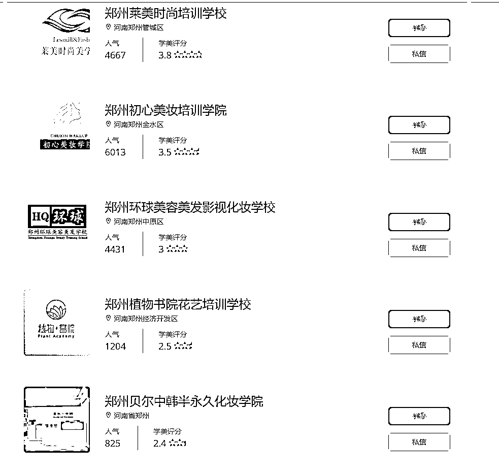

# 抖音美业学校获客方式

> 原文：[`www.yuque.com/for_lazy/xkrm14/wyzf1o0xidfpads9`](https://www.yuque.com/for_lazy/xkrm14/wyzf1o0xidfpads9)

<ne-p id="ud7302f69" data-lake-id="ud7302f69"><ne-text id="u7972254b">作者： 小牛</ne-text></ne-p> <ne-p id="u0fc06b3d" data-lake-id="u0fc06b3d"><ne-text id="uba56aaa3">日期：2023-01-31</ne-text></ne-p> <ne-p id="u26a11655" data-lake-id="u26a11655"><ne-text id="ub8b7d350">点赞数：</ne-text><ne-text id="ud7490af4" ne-bold="true">24</ne-text></ne-p> <ne-hole id="u2024cef1" data-lake-id="u2024cef1"><ne-card data-card-name="hr" data-card-type="block" id="SVAWl" data-event-boundary="card"><ne-p id="u17796948" data-lake-id="u17796948"><ne-text id="ude4c4c6a">抖音找美业学校，推荐学校账号，找学校合作拿提成。 官网都是留的统一的联系方式，进行招生转介绍。</ne-text></ne-p> <ne-p id="u32fa7e52" data-lake-id="u32fa7e52"><ne-card data-card-name="image" data-card-type="inline" id="eDXWc" data-event-boundary="card">  <ne-p id="u38b1f0f1" data-lake-id="u38b1f0f1"><ne-card data-card-name="image" data-card-type="inline" id="Dzk0g" data-event-boundary="card">  <ne-hole id="u2b092f2c" data-lake-id="u2b092f2c"><ne-card data-card-name="hr" data-card-type="block" id="xoqYp" data-event-boundary="card"><ne-p id="u84522c61" data-lake-id="u84522c61"><ne-text id="uf3ec971f">公众号懒人找资源，懒人专属群分享</ne-text></ne-p></ne-card></ne-hole></ne-card></ne-p></ne-card></ne-p></ne-card></ne-hole>