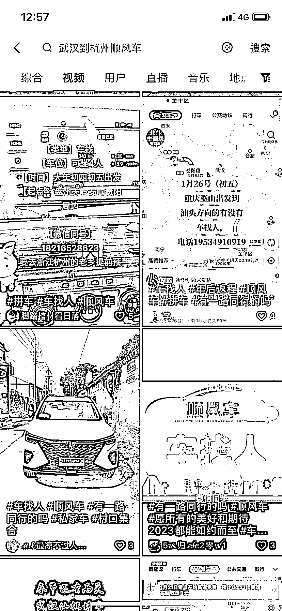
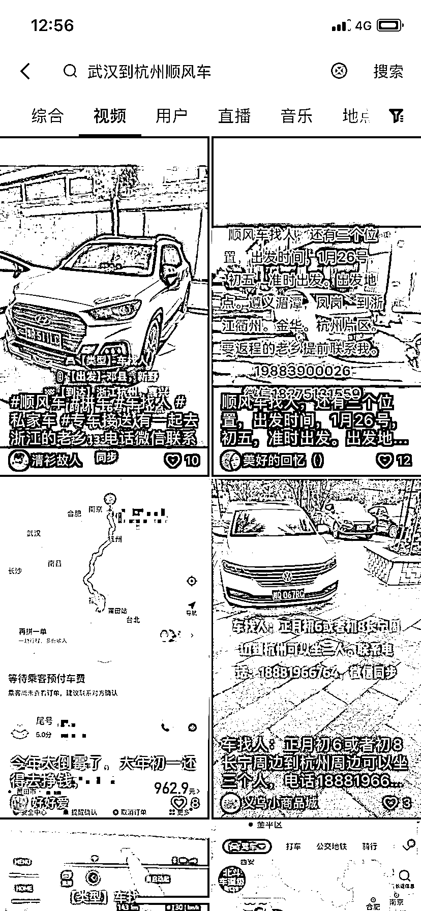

# 抖音引流拼车服务

> 原文：[`www.yuque.com/for_lazy/xkrm14/mnuhmqgi5t6cot6z`](https://www.yuque.com/for_lazy/xkrm14/mnuhmqgi5t6cot6z)

作者： Ruii 

日期：2023-01-31 

点赞数：31 

过年上舅舅家拜年，听舅妈说她没买到车票，然后就在抖音上找了个顺风车，并留了联系方式。 从杭州回湖北老家，450 元/人。 后面过完年，老舅和舅妈又是在抖音上联系的顺风车，从湖北老家到温州，还加了一个专门拼车的老乡群。 年纪有些大，也不太会用其它像什么嘀嗒拼车之类得顺风车 app。不知道抖音会不会布局这一块，不过大家正好利用抖音解决了这么一个需求。 如果专门跑顺风车，可以抖音引流，除了赚油费过路费外。我还想到一个变现方式，就是拉群卖土特产，哈哈。 

 

 

