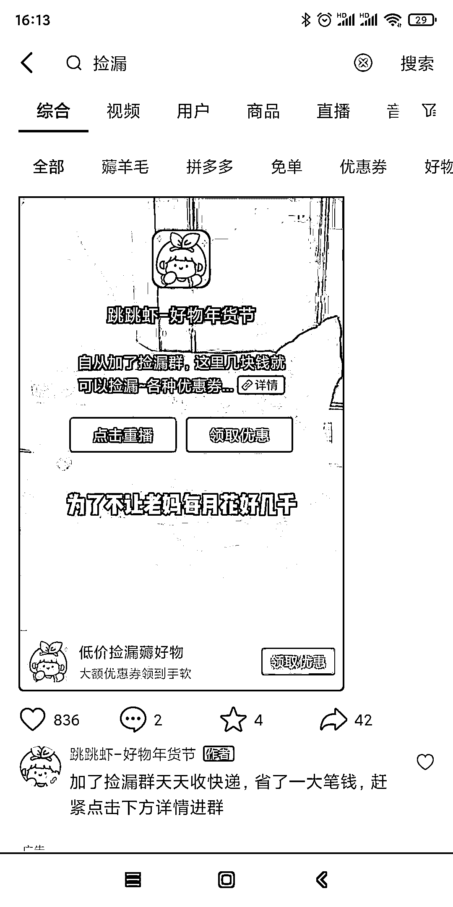

# 抖音可以布局长尾关键词，做 SEO

> 原文：[`www.yuque.com/for_lazy/xkrm14/gedqkfvsxl22n07a`](https://www.yuque.com/for_lazy/xkrm14/gedqkfvsxl22n07a)

<ne-p id="u462c05cb" data-lake-id="u462c05cb"><ne-text id="u6ba3d513">作者： 阿 Lin</ne-text></ne-p> <ne-p id="uef3703ba" data-lake-id="uef3703ba"><ne-text id="u8b5cb21d">日期：2023-01-31</ne-text></ne-p> <ne-p id="u045d7102" data-lake-id="u045d7102"><ne-text id="u47eacf51">点赞数：</ne-text><ne-text id="u827b774c" ne-bold="true">16</ne-text></ne-p> <ne-hole id="u8a286e35" data-lake-id="u8a286e35"><ne-card data-card-name="hr" data-card-type="block" id="H57K9" data-event-boundary="card"><ne-p id="u7e4aed27" data-lake-id="u7e4aed27"><ne-text id="u327f9de6">抖音搜索“捡漏”这个词很多是投放的，可是，捡漏的长尾关键词却没有人做，“淘宝 0 元免单捡漏”第一第二天居然是 2020 年，和 2019 年发的抖音。流量没人要，seo 的机会呀！</ne-text></ne-p> <ne-p id="u8a087bb4" data-lake-id="u8a087bb4"><ne-card data-card-name="image" data-card-type="inline" id="lkMxL" data-event-boundary="card"></ne-card></ne-p> <ne-p id="uc1b99282" data-lake-id="uc1b99282"><ne-card data-card-name="image" data-card-type="inline" id="QRj0Z" data-event-boundary="card"></ne-card></ne-p> <ne-hole id="u1ce8c199" data-lake-id="u1ce8c199"><ne-card data-card-name="hr" data-card-type="block" id="mFVCZ" data-event-boundary="card"><ne-p id="u3744bd41" data-lake-id="u3744bd41"><ne-text id="u67aa540e">公众号懒人找资源，懒人专属群分享</ne-text></ne-p></ne-card></ne-hole></ne-card></ne-hole>