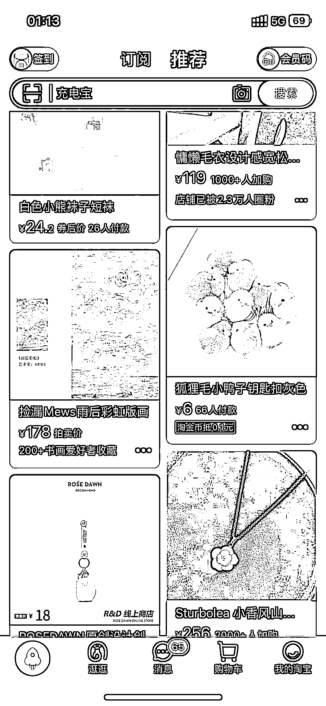
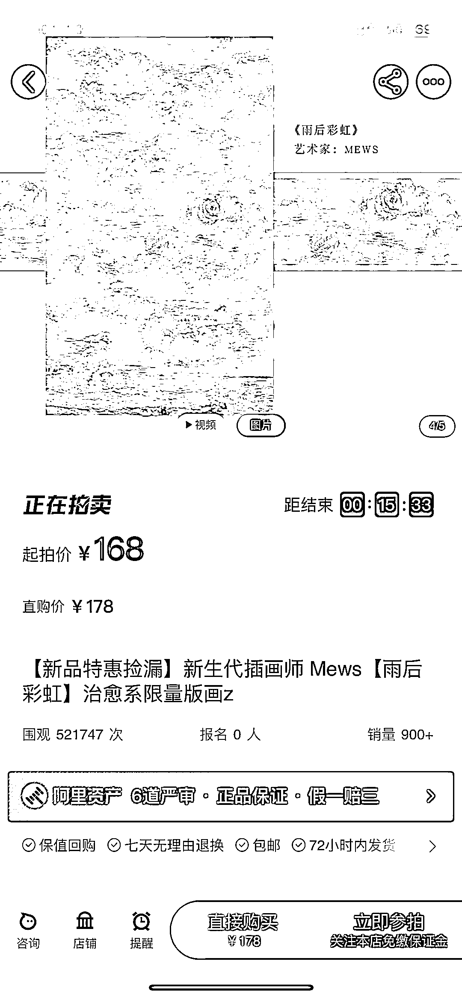

# AI 绘画，电商平台拍卖

> 原文：[`www.yuque.com/for_lazy/xkrm14/ewtn2n8fzdg461xf`](https://www.yuque.com/for_lazy/xkrm14/ewtn2n8fzdg461xf)

<ne-p id="u2933523c" data-lake-id="u2933523c"><ne-text id="u6dc164a8">作者： 英麒 Ryan</ne-text></ne-p> <ne-p id="ued0d5943" data-lake-id="ued0d5943"><ne-text id="u0a44e09f">日期：2023-02-02</ne-text></ne-p> <ne-p id="ufcf71995" data-lake-id="ufcf71995"><ne-text id="u1444329e">点赞数：</ne-text><ne-text id="ua9174756" ne-bold="true">31</ne-text></ne-p> <ne-hole id="uc83778c9" data-lake-id="uc83778c9"><ne-card data-card-name="hr" data-card-type="block" id="SoeZa" data-event-boundary="card"><ne-p id="u017506a7" data-lake-id="u017506a7"><ne-text id="u1b215442">AI 绘画，印刷出来简单裱一下，挂阿里拍卖，推到淘宝和咸鱼。 我看有些画家除了署名，还会手写编号，假意是限量款。 关键词：捡漏画、限量、清仓</ne-text></ne-p> <ne-p id="u81e262c6" data-lake-id="u81e262c6"><ne-card data-card-name="image" data-card-type="inline" id="OSq0F" data-event-boundary="card"></ne-card></ne-p> <ne-p id="u35aca841" data-lake-id="u35aca841"><ne-card data-card-name="image" data-card-type="inline" id="BN8hs" data-event-boundary="card"></ne-card></ne-p> <ne-p id="u45260ed6" data-lake-id="u45260ed6"><ne-card data-card-name="image" data-card-type="inline" id="ML8EA" data-event-boundary="card"></ne-card></ne-p> <ne-hole id="u730f5bc7" data-lake-id="u730f5bc7"><ne-card data-card-name="hr" data-card-type="block" id="uEAmV" data-event-boundary="card"><ne-p id="uc19503ac" data-lake-id="uc19503ac"><ne-text id="u1f78fdc3">公众号懒人找资源，懒人专属群分享</ne-text></ne-p></ne-card></ne-hole></ne-card></ne-hole>