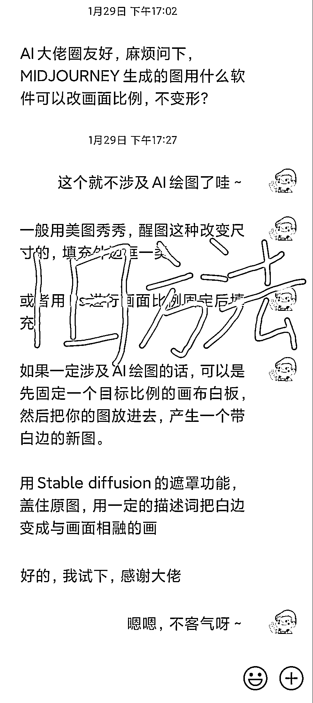
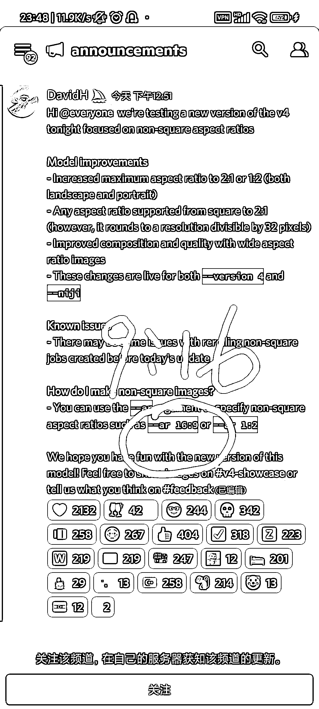
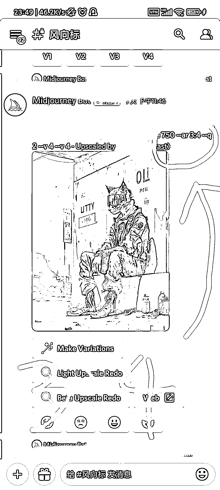
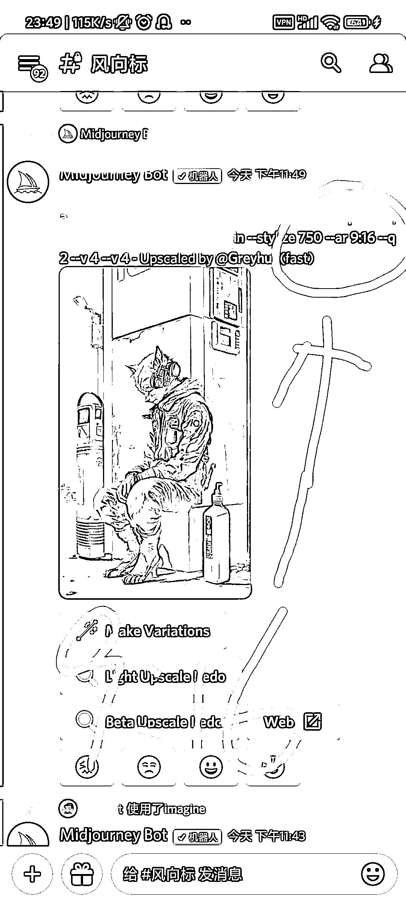
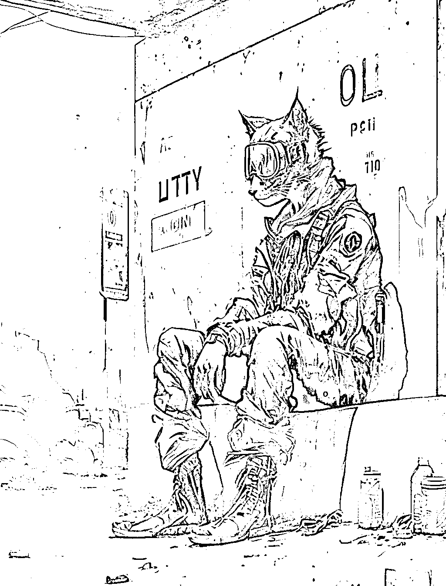
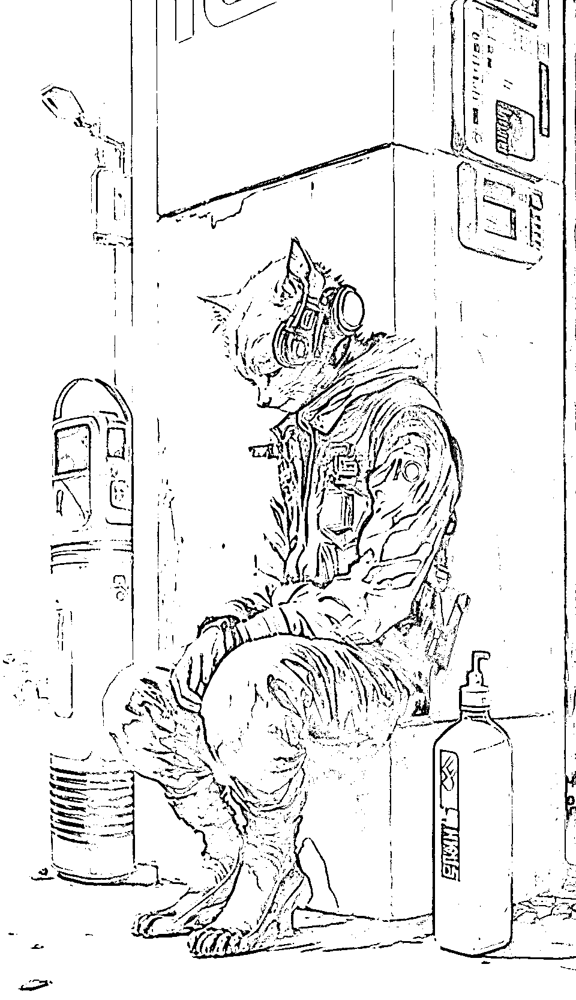

# Midjourney 绘画软件新功能

> 原文：[`www.yuque.com/for_lazy/xkrm14/bqp3di11klxuayrx`](https://www.yuque.com/for_lazy/xkrm14/bqp3di11klxuayrx)

作者： 天辉 

日期：2023-02-03 

点赞数：34 

【风向标信息】 Midjourney 绘画软件的 v4 模型以及二次元专精 Niji 模型，已经可以直接画图片比例为 3：4，或者 9：16 尺寸的图了，这两个尺寸，在去年 11 月到昨天为止，都是没有办法直接生成的。 但是现在，可以了， 需要结合 Stable diffusion 进行复杂的图片比例调整已经成为过去式。 【带来的提升】 可以 1 分钟，直接出 小红书最佳尺寸比例 3：4 抖音等最佳尺寸比例 9：16 效率直线上升 【时效性】 今天下午刚实现的功能 

 

 

 

 

 

 

