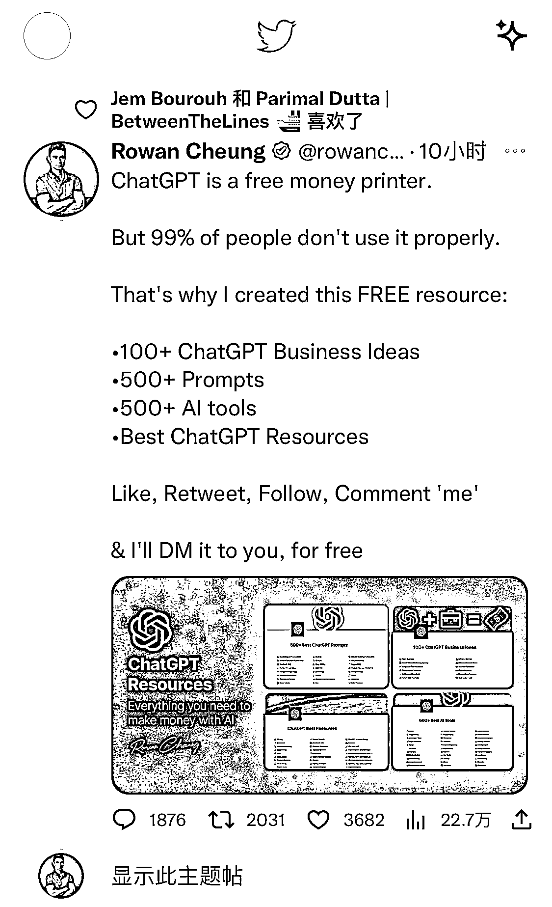
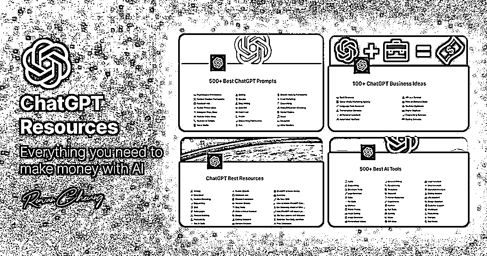

# 围绕 chatgpt 开始引流与转化

> 原文：[`www.yuque.com/for_lazy/xkrm14/wdee2c55nwaa3oc4`](https://www.yuque.com/for_lazy/xkrm14/wdee2c55nwaa3oc4)

作者： 标叔 

日期：2023-01-30 

点赞数：34 

围绕 chatgpt 开始引流与转化。 那句老话，在大平台下做周边工具、服务是一个好选择，chatgpt 就是这样风口上的大平台，潜力还没怎么释放，国内需要有人尽快的去占住各个节点的生态位，对应的都有很大的商业价值。 有哪些可能的生态位？ 公众号、小红书、抖音、SEO、小程序、社群、课程、训练营、玩法、提示词、工具、资料包、使用场景、成功案例、行业实践、资讯同步等。 

 

 

