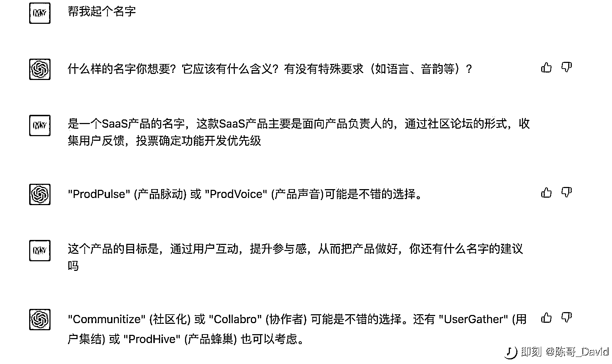

# 利用 ChatGPT，给公司和产品取名

> 原文：[`www.yuque.com/for_lazy/xkrm14/rftq278qehwhtn60`](https://www.yuque.com/for_lazy/xkrm14/rftq278qehwhtn60)

<ne-p id="u03dba24d" data-lake-id="u03dba24d"><ne-text id="u83f525c6">作者： 子凌</ne-text></ne-p> <ne-p id="uc071d291" data-lake-id="uc071d291"><ne-text id="ub0f7409d">日期：2023-01-30</ne-text></ne-p> <ne-p id="u01f59e51" data-lake-id="u01f59e51"><ne-text id="u7be45fcb">点赞数：</ne-text><ne-text id="u9871328e" ne-bold="true">15</ne-text></ne-p> <ne-hole id="u1454fed2" data-lake-id="u1454fed2"><ne-card data-card-name="hr" data-card-type="block" id="PsfSN" data-event-boundary="card"><ne-p id="u4f6f40c0" data-lake-id="u4f6f40c0"><ne-text id="u0b7da6b7">公司和产品取名一直是个痛点，自从用了 chatGPT 取名，速度提高了不少，应该是个可以落地的商业化场景。有感兴趣的可以一起探讨下。</ne-text></ne-p> <ne-p id="ua90a97c1" data-lake-id="ua90a97c1"><ne-card data-card-name="image" data-card-type="inline" id="Qut9R" data-event-boundary="card"></ne-card></ne-p> <ne-hole id="ufc172ffc" data-lake-id="ufc172ffc"><ne-card data-card-name="hr" data-card-type="block" id="Stu0J" data-event-boundary="card"><ne-p id="ua2fccec4" data-lake-id="ua2fccec4"><ne-text id="uf31d41c9">公众号懒人找资源，懒人专属群分享</ne-text></ne-p></ne-card></ne-hole></ne-card></ne-hole>