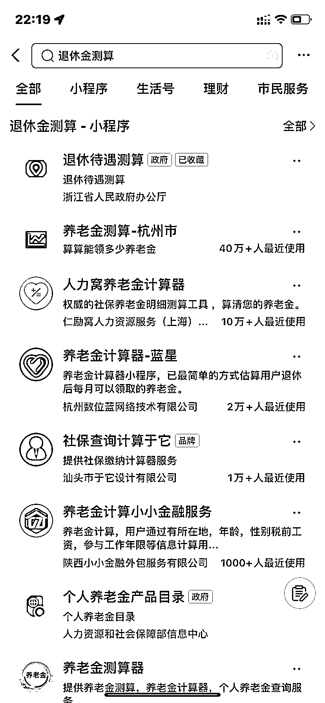

# 利用支付宝退休金教程引流方案

> 原文：[`www.yuque.com/for_lazy/xkrm14/awl1rkrydbgnms9w`](https://www.yuque.com/for_lazy/xkrm14/awl1rkrydbgnms9w)

<ne-p id="ufbe1d10b" data-lake-id="ufbe1d10b"><ne-text id="u197bc368">作者： 橙光</ne-text></ne-p> <ne-p id="u186f1ffa" data-lake-id="u186f1ffa"><ne-text id="uda6f0588">日期：2023-02-02</ne-text></ne-p> <ne-p id="u642ae4d3" data-lake-id="u642ae4d3"><ne-text id="u751eb630">点赞数：</ne-text><ne-text id="ue76b8d30" ne-bold="true">12</ne-text></ne-p> <ne-hole id="u1fb64beb" data-lake-id="u1fb64beb"><ne-card data-card-name="hr" data-card-type="block" id="TMv0C" data-event-boundary="card"><ne-p id="u27c5bfdd" data-lake-id="u27c5bfdd"><ne-text id="u714d5803">今天新闻延迟退休，大家都在算，退休金有多少提供一个计算的途径</ne-text> <ne-text id="u6db142a1">可以打开支付宝搜索框输入退休金测算根据下图进行选择赶紧看看退休金有多少钱吧是不是也可以把它做成一个小教程拿来引流教别人怎么去查</ne-text></ne-p> <ne-p id="u707a0d54" data-lake-id="u707a0d54"><ne-card data-card-name="image" data-card-type="inline" id="STW9D" data-event-boundary="card">  <ne-p id="u89d2d9b8" data-lake-id="u89d2d9b8"><ne-card data-card-name="image" data-card-type="inline" id="p3N1b" data-event-boundary="card">  <ne-p id="u5eb18d06" data-lake-id="u5eb18d06"><ne-card data-card-name="image" data-card-type="inline" id="J3Hvk" data-event-boundary="card">  <ne-hole id="ua8b2acf0" data-lake-id="ua8b2acf0"><ne-card data-card-name="hr" data-card-type="block" id="BzWFN" data-event-boundary="card"><ne-p id="uf5826140" data-lake-id="uf5826140"><ne-text id="ud87a8587">公众号懒人找资源，懒人专属群分享</ne-text></ne-p></ne-card></ne-hole></ne-card></ne-p></ne-card></ne-p></ne-card></ne-p></ne-card></ne-hole>