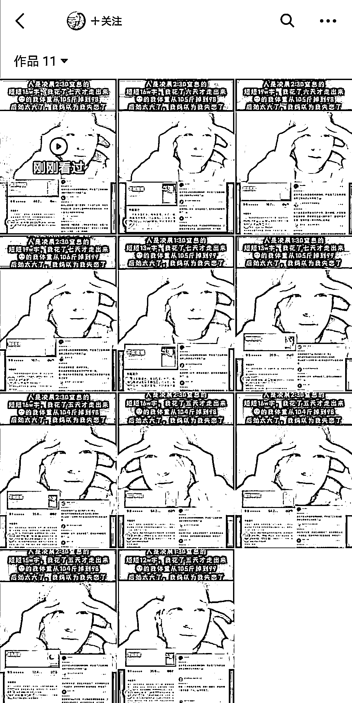

# 小说推文短视频，利用哭泣视频带动情绪

> 原文：[`www.yuque.com/for_lazy/xkrm14/vs8so4m10s7qrrm3`](https://www.yuque.com/for_lazy/xkrm14/vs8so4m10s7qrrm3)

<ne-p id="uee229e16" data-lake-id="uee229e16"><ne-text id="uea4f9fd8">作者： 嘟</ne-text></ne-p> <ne-p id="ucab48724" data-lake-id="ucab48724"><ne-text id="uf751a5e0">日期：2023-02-02</ne-text></ne-p> <ne-p id="u5f8671c5" data-lake-id="u5f8671c5"><ne-text id="u613d0e2e">点赞数：</ne-text><ne-text id="u5a6011a1" ne-bold="true">18</ne-text></ne-p> <ne-hole id="u27a79b1f" data-lake-id="u27a79b1f"><ne-card data-card-name="hr" data-card-type="block" id="FhfTc" data-event-boundary="card"><ne-p id="uee7e0167" data-lake-id="uee7e0167"><ne-text id="u4fcce0fb">小说推文，大多数情况推的是情绪，情绪到了，去下载、付费的冲动感觉就来了。</ne-text> <ne-text id="u212c9ce9">这个账号，用的全是同一个哭的视频，每次换不同文案和小说介绍，个个都是爆款，简单高效。 其他需要带情绪的营销方向也可以试一下这种玩法。</ne-text></ne-p> <ne-p id="u74007727" data-lake-id="u74007727"><ne-card data-card-name="image" data-card-type="inline" id="zFPwa" data-event-boundary="card">  <ne-hole id="u601398a9" data-lake-id="u601398a9"><ne-card data-card-name="hr" data-card-type="block" id="H2Gge" data-event-boundary="card"><ne-p id="uee957063" data-lake-id="uee957063"><ne-text id="uebe6be67">公众号懒人找资源，懒人专属群分享</ne-text></ne-p></ne-card></ne-hole></ne-card></ne-p></ne-card></ne-hole>