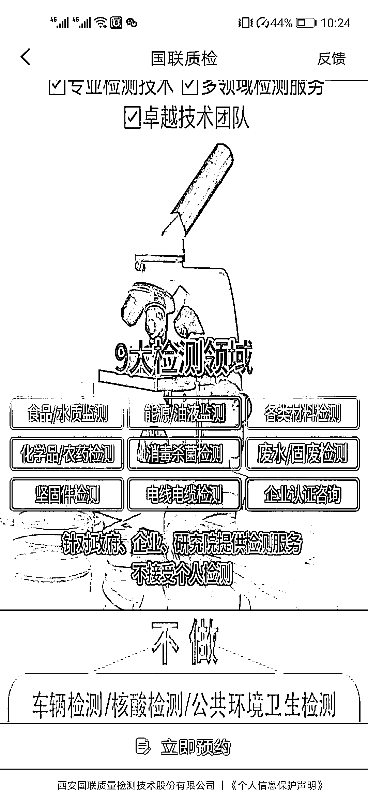

# 销售产品检测报告服务

> 原文：[`www.yuque.com/for_lazy/xkrm14/qoisexzg5tgaz1ms`](https://www.yuque.com/for_lazy/xkrm14/qoisexzg5tgaz1ms)

<ne-p id="ub8ef329e" data-lake-id="ub8ef329e"><ne-text id="ubdc3c1c8">作者： 一登</ne-text></ne-p> <ne-p id="ud1ab2e0e" data-lake-id="ud1ab2e0e"><ne-text id="u8e5ae128">日期：2023-02-01</ne-text></ne-p> <ne-p id="u227127dd" data-lake-id="u227127dd"><ne-text id="u4358a84b">点赞数：</ne-text><ne-text id="uaa8ac811" ne-bold="true">3</ne-text></ne-p> <ne-hole id="u800f36a0" data-lake-id="u800f36a0"><ne-card data-card-name="hr" data-card-type="block" id="t86qD" data-event-boundary="card"><ne-p id="ud60fd7b0" data-lake-id="ud60fd7b0"><ne-text id="ub9823b34">每个企业产品都要做检测报告，尤其是食品生产企业，产品越多检测越多。这个业务市场容量大，客单价高（基本都是好几千上万），且每年回购哦！并且对接的是 ToB.</ne-text> <ne-text id="ua87be671">客户维护很省心，一般客户变动也很小，回购率很高。</ne-text></ne-p> <ne-p id="u06245783" data-lake-id="u06245783"><ne-card data-card-name="image" data-card-type="inline" id="sn3PP" data-event-boundary="card"></ne-card></ne-p> <ne-p id="uf4410a20" data-lake-id="uf4410a20"><ne-card data-card-name="image" data-card-type="inline" id="rXXoS" data-event-boundary="card"></ne-card></ne-p> <ne-hole id="ude73c7fb" data-lake-id="ude73c7fb"><ne-card data-card-name="hr" data-card-type="block" id="QZ8zj" data-event-boundary="card"><ne-p id="u0851abba" data-lake-id="u0851abba"><ne-text id="u0e1e20f9">公众号懒人找资源，懒人专属群分享</ne-text></ne-p></ne-card></ne-hole></ne-card></ne-hole>