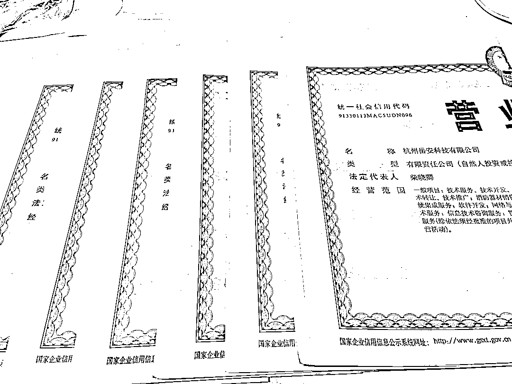
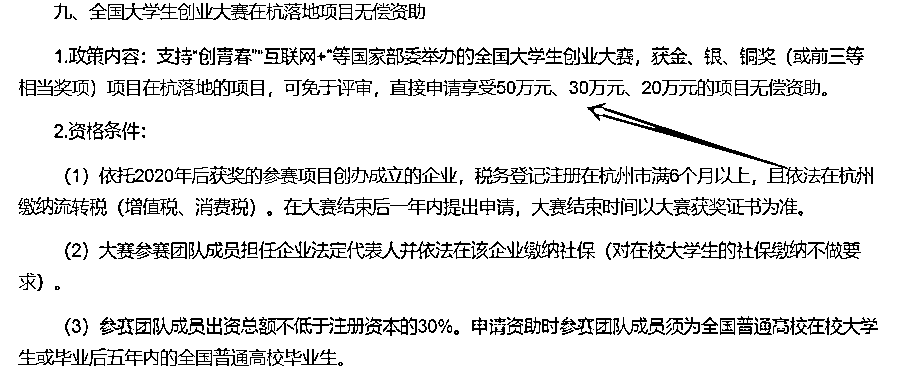
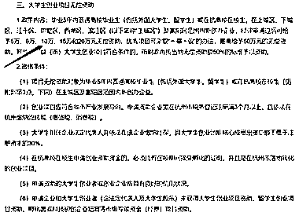

# 杭创未来·大学生创业创新创业行动计划

> 原文：[`www.yuque.com/for_lazy/xkrm14/bfig304hw3g77ts0`](https://www.yuque.com/for_lazy/xkrm14/bfig304hw3g77ts0)

作者： 大俊 

日期：2023-01-31 

点赞数：13 

杭创未来·大学生创业创新创业行动计划（2020-2022）最后一年，三年政策已经发放 6000 亿补贴，有符合条件的圈友可以申报起来了哦，之前我有帖子写了自己大学做政策申报的经历，目前在杭州也落地了几个杭创项目，圈友们可以看看，有业务合作的可以加微信 15658227003 [https://t.zsxq.com/0aytBME05](https://t.zsxq.com/0aytBME05) 

  

  

  

  

  

  

