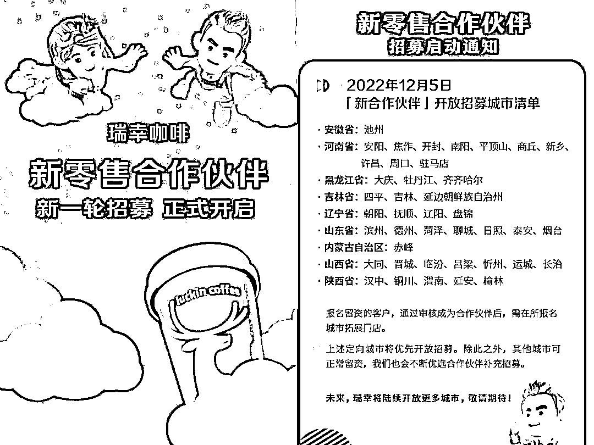
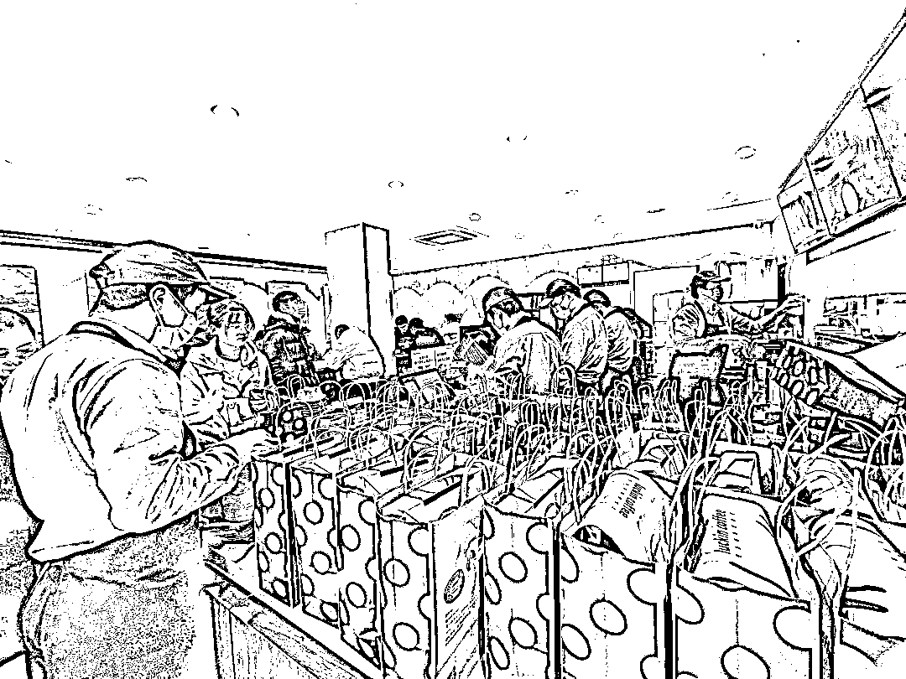

# 瑞幸开放下沉市场加盟

> 原文：[`www.yuque.com/for_lazy/xkrm14/nol0uss8vigi1duw`](https://www.yuque.com/for_lazy/xkrm14/nol0uss8vigi1duw)

<ne-p id="udc2e4a86" data-lake-id="udc2e4a86"><ne-text id="uef17c3ed">作者： 陈雪🦉碎碎念</ne-text></ne-p> <ne-p id="u94525723" data-lake-id="u94525723"><ne-text id="u89e5162e">日期：2023-01-31</ne-text></ne-p> <ne-p id="u7fa3271f" data-lake-id="u7fa3271f"><ne-text id="u68da8026">点赞数：</ne-text><ne-text id="u86af06da" ne-bold="true">14</ne-text></ne-p> <ne-hole id="u1fb681c2" data-lake-id="u1fb681c2"><ne-card data-card-name="hr" data-card-type="block" id="TlVie" data-event-boundary="card"><ne-p id="ufd7df89a" data-lake-id="ufd7df89a"><ne-text id="ue7e12a86">关注下瑞幸下沉市场 这个春节我们老家小县城开了第一家瑞幸 太火爆了 一进去看见 7 个店员 还有很多人在等取单 听说一天做了 800 杯 。</ne-text> <ne-text id="ue177dd4a">看了下瑞幸又在一轮开放下沉市场加盟了，没有加盟费但是前期投入倒是不低。如果在小县城 有房租 人工优势的 可以关注下 还有一些数据参考</ne-text></ne-p> <ne-p id="u2b2cec44" data-lake-id="u2b2cec44"><ne-card data-card-name="image" data-card-type="inline" id="icg0K" data-event-boundary="card">  <ne-p id="ub473f25f" data-lake-id="ub473f25f"><ne-card data-card-name="image" data-card-type="inline" id="fRPD2" data-event-boundary="card">  <ne-p id="u89ea0810" data-lake-id="u89ea0810"><ne-card data-card-name="image" data-card-type="inline" id="S9bAE" data-event-boundary="card">  <ne-p id="ucb164425" data-lake-id="ucb164425"><ne-card data-card-name="image" data-card-type="inline" id="pYez7" data-event-boundary="card">  <ne-p id="uf0b6b128" data-lake-id="uf0b6b128"><ne-card data-card-name="image" data-card-type="inline" id="LzeE6" data-event-boundary="card">  <ne-hole id="ub6d60ac4" data-lake-id="ub6d60ac4"><ne-card data-card-name="hr" data-card-type="block" id="yCNkV" data-event-boundary="card"><ne-p id="uee49a9c8" data-lake-id="uee49a9c8"><ne-text id="u92dd2202">公众号懒人找资源，懒人专属群分享</ne-text></ne-p></ne-card></ne-hole></ne-card></ne-p></ne-card></ne-p></ne-card></ne-p></ne-card></ne-p></ne-card></ne-p></ne-card></ne-hole>