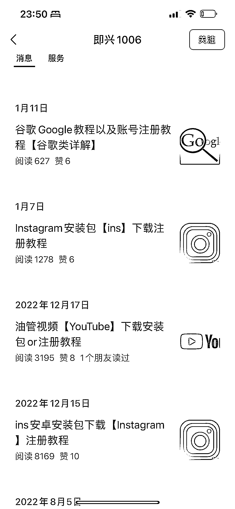

# 围绕 xx 软件下载的关键词做搜一搜 seo

> 原文：[`www.yuque.com/for_lazy/xkrm14/xkocwz1atyywe3wg`](https://www.yuque.com/for_lazy/xkrm14/xkocwz1atyywe3wg)

<ne-p id="u3bd444a9" data-lake-id="u3bd444a9"><ne-text id="u2f6c02a5">作者： 标叔</ne-text></ne-p> <ne-p id="u6a6910a4" data-lake-id="u6a6910a4"><ne-text id="u14282be1">日期：2023-01-30</ne-text></ne-p> <ne-p id="u0147007c" data-lake-id="u0147007c"><ne-text id="u0cc7d876">点赞数：</ne-text><ne-text id="uea6e4584" ne-bold="true">25</ne-text></ne-p> <ne-hole id="ud68fde64" data-lake-id="ud68fde64"><ne-card data-card-name="hr" data-card-type="block" id="MGVAD" data-event-boundary="card"><ne-p id="u9fb23dc2" data-lake-id="u9fb23dc2"><ne-text id="u34ef251e">围绕 xx 软件下载的关键词做搜一搜 seo，竞争不大，导流容易，变现不多讲。 但有一种方式，做国外付费工具（比如 4k</ne-text> <ne-text id="ub3ddcb7e">download）的 affiliate 赚佣金，效果应该还行。</ne-text></ne-p> <ne-p id="ufc7a2c14" data-lake-id="ufc7a2c14"><ne-card data-card-name="image" data-card-type="inline" id="uQBfH" data-event-boundary="card">  <ne-p id="ube50b887" data-lake-id="ube50b887"><ne-card data-card-name="image" data-card-type="inline" id="EGA7M" data-event-boundary="card"></ne-card></ne-p> <ne-p id="u32515935" data-lake-id="u32515935"><ne-card data-card-name="image" data-card-type="inline" id="gTsEs" data-event-boundary="card"></ne-card></ne-p> <ne-hole id="u472bbd38" data-lake-id="u472bbd38"><ne-card data-card-name="hr" data-card-type="block" id="Rmv6j" data-event-boundary="card"><ne-p id="u02004eb5" data-lake-id="u02004eb5"><ne-text id="u29305cf7">公众号懒人找资源，懒人专属群分享</ne-text></ne-p></ne-card></ne-hole></ne-card></ne-p></ne-card></ne-hole>