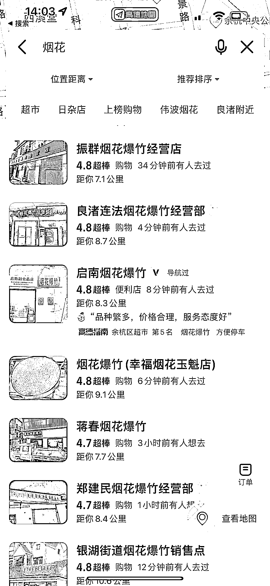

# 不允许在电商平台售卖的产品，可以通过地图标注引流

> 原文：[`www.yuque.com/for_lazy/xkrm14/lgq2xeu5ogtzgm5g`](https://www.yuque.com/for_lazy/xkrm14/lgq2xeu5ogtzgm5g)

作者： 标叔 

日期：2023-01-30 

点赞数：27 

一些商品不允许在电商平台售卖，地图的标注功能就有了很好的引流效果。 比如烟火爆竹这种，效果非常好，我去买的 10 分钟内就有 3 个从地图上来的客户。 可以找对应的商店，给他们提供收费标注服务。 也可以自己找货源，自己开店，然后运营好地图标注引流。 发散思考下，除了烟火还有哪些线上禁售的品类可以这么干。 

 

 

