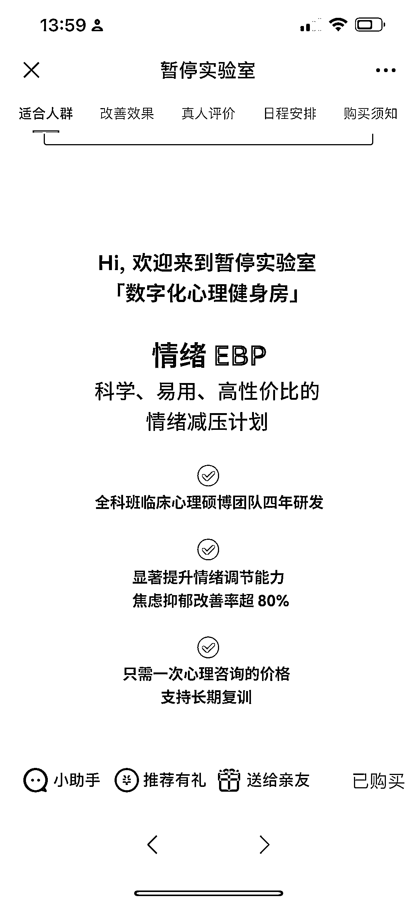
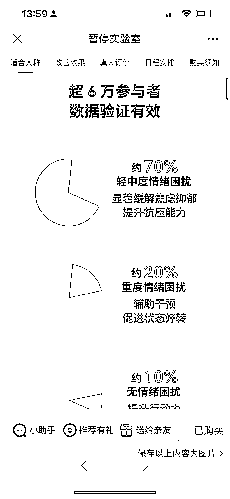

# 情绪修复线上训练营，可操作思路

> 原文：[`www.yuque.com/for_lazy/xkrm14/lmq1eqtl60wccmd7`](https://www.yuque.com/for_lazy/xkrm14/lmq1eqtl60wccmd7)

<ne-p id="u5ab0623d" data-lake-id="u5ab0623d"><ne-text id="u131d7682">作者： 标叔</ne-text></ne-p> <ne-p id="u4ee58f24" data-lake-id="u4ee58f24"><ne-text id="ud91e5bfd">日期：2023-01-30</ne-text></ne-p> <ne-p id="u911a6b91" data-lake-id="u911a6b91"><ne-text id="u09925aa0">点赞数：</ne-text><ne-text id="u223854e6" ne-bold="true">22</ne-text></ne-p> <ne-hole id="u4e39cc74" data-lake-id="u4e39cc74"><ne-card data-card-name="hr" data-card-type="block" id="rzGnM" data-event-boundary="card"><ne-p id="u2aab4b96" data-lake-id="u2aab4b96"><ne-text id="u0b8e98dd">疫情这几年，好多人产生情绪问题，情绪修复线上训练营，5000 万销售额，而且很多人还不知道这个产品，需求旺盛。</ne-text> <ne-text id="u6b726a10">这种产品有专业门槛，但我们可以转换思路，买断一些课程做投放，或者成为这个产品的分销。</ne-text> <ne-text id="ucf6bb455">之前看到的心理倾听师，规避了心理咨询师的专业场景，其实也是情绪修复场景下的产品。</ne-text></ne-p> <ne-p id="u6fdcbcb1" data-lake-id="u6fdcbcb1"><ne-card data-card-name="image" data-card-type="inline" id="ya3oh" data-event-boundary="card"></ne-card></ne-p> <ne-p id="ud0cdeb81" data-lake-id="ud0cdeb81"><ne-card data-card-name="image" data-card-type="inline" id="RlGtd" data-event-boundary="card"></ne-card></ne-p> <ne-p id="u3e47ad4a" data-lake-id="u3e47ad4a"><ne-card data-card-name="image" data-card-type="inline" id="pLLVO" data-event-boundary="card"></ne-card></ne-p> <ne-p id="u34410cee" data-lake-id="u34410cee"><ne-card data-card-name="image" data-card-type="inline" id="VBPH2" data-event-boundary="card"></ne-card></ne-p> <ne-p id="ue351f24d" data-lake-id="ue351f24d"><ne-card data-card-name="image" data-card-type="inline" id="fMfL1" data-event-boundary="card"></ne-card></ne-p> <ne-p id="u9cc3654f" data-lake-id="u9cc3654f"><ne-card data-card-name="image" data-card-type="inline" id="fvcZ9" data-event-boundary="card"></ne-card></ne-p> <ne-p id="u70bba534" data-lake-id="u70bba534"><ne-card data-card-name="image" data-card-type="inline" id="OnZlU" data-event-boundary="card"></ne-card></ne-p> <ne-p id="u2561598c" data-lake-id="u2561598c"><ne-card data-card-name="image" data-card-type="inline" id="mw71i" data-event-boundary="card"></ne-card></ne-p> <ne-hole id="u24b1f9c8" data-lake-id="u24b1f9c8"><ne-card data-card-name="hr" data-card-type="block" id="Za7st" data-event-boundary="card"><ne-p id="u1780307e" data-lake-id="u1780307e"><ne-text id="u5f1db916">公众号懒人找资源，懒人专属群分享</ne-text></ne-p></ne-card></ne-hole></ne-card></ne-hole>