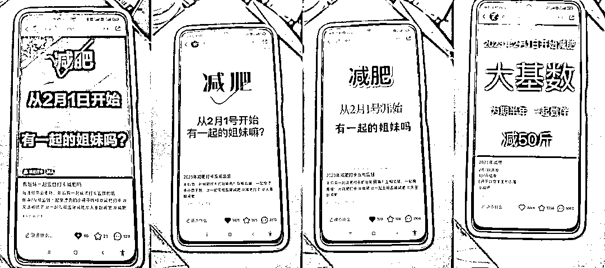

# 小红书矩阵减肥打卡笔记，引流私域

> 原文：[`www.yuque.com/for_lazy/xkrm14/ytm12a874ghq8iqy`](https://www.yuque.com/for_lazy/xkrm14/ytm12a874ghq8iqy)

<ne-p id="ufaaae2f1" data-lake-id="ufaaae2f1"><ne-text id="u9ad8e1b1">作者： 马克图布</ne-text></ne-p> <ne-p id="ub8a3e10b" data-lake-id="ub8a3e10b"><ne-text id="u7e0b3163">日期：2023-01-30</ne-text></ne-p> <ne-p id="u76374a58" data-lake-id="u76374a58"><ne-text id="ubb4c4e2d">点赞数：</ne-text><ne-text id="u52d0f244" ne-bold="true">24</ne-text></ne-p> <ne-hole id="ub798613d" data-lake-id="ub798613d"><ne-card data-card-name="hr" data-card-type="block" id="pjLYO" data-event-boundary="card"><ne-p id="u8ec39030" data-lake-id="u8ec39030"><ne-text id="ufeac2ecb">减肥打卡领域流量密码，需要多账号并行方式。 就是说监督减肥打卡，类似这样子，制作图片可以批量化，特别好操作。</ne-text> <ne-text id="u445d9cc6">然后同时就建了一个小红书的粉丝群，然后在群里面群公告进行引导加微信。</ne-text> <ne-text id="ub0933564">公告内容：就是说想要真心参与打卡的，需要有一定的门槛，比如说付费对不对，然后加我微信啥啥啥。 然后在群里定期的引流就好了，因为人会不断的进来。</ne-text> <ne-text id="ua5589ebb">流量很凶。能看到很多账号都是这个方式，就发一篇笔记。然后火了不断引流。</ne-text></ne-p> <ne-p id="u6f044601" data-lake-id="u6f044601"><ne-card data-card-name="image" data-card-type="inline" id="HSbN3" data-event-boundary="card"></ne-card></ne-p> <ne-p id="u62e569ac" data-lake-id="u62e569ac"><ne-card data-card-name="image" data-card-type="inline" id="GA3In" data-event-boundary="card"></ne-card></ne-p> <ne-p id="ue398088e" data-lake-id="ue398088e"><ne-card data-card-name="image" data-card-type="inline" id="AfbUC" data-event-boundary="card">  <ne-p id="uaaae0fdb" data-lake-id="uaaae0fdb"><ne-card data-card-name="image" data-card-type="inline" id="pNd4t" data-event-boundary="card"></ne-card></ne-p> <ne-hole id="u5ea10bfc" data-lake-id="u5ea10bfc"><ne-card data-card-name="hr" data-card-type="block" id="A4F5o" data-event-boundary="card"><ne-p id="u17dfab18" data-lake-id="u17dfab18"><ne-text id="u0eb971e3">公众号懒人找资源，懒人专属群分享</ne-text></ne-p></ne-card></ne-hole></ne-card></ne-p></ne-card></ne-hole>