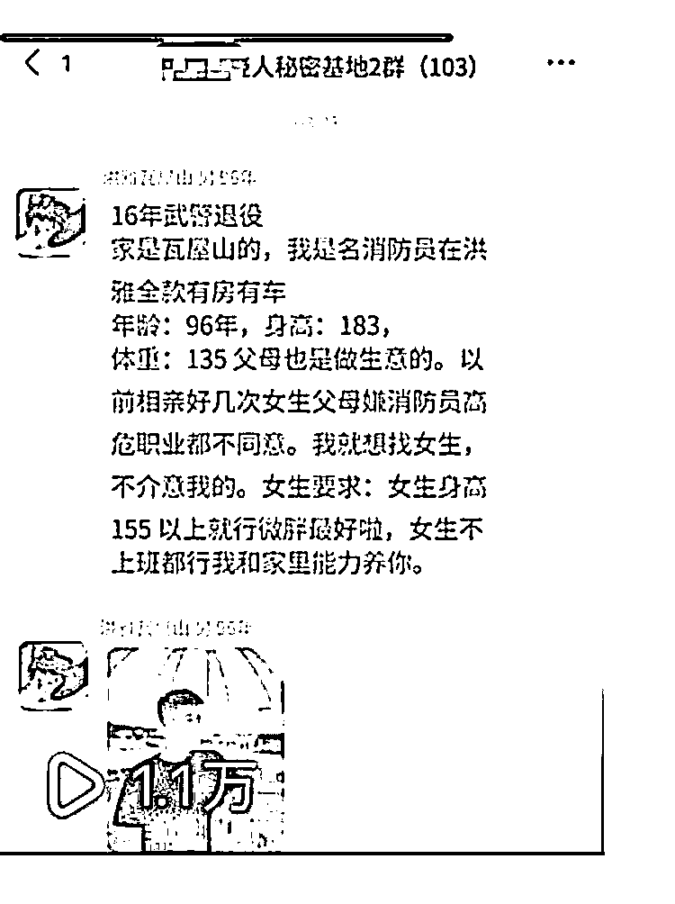

# 抖音引流同城相亲群

> 原文：[`www.yuque.com/for_lazy/xkrm14/cl972d1qhasb5wml`](https://www.yuque.com/for_lazy/xkrm14/cl972d1qhasb5wml)

<ne-p id="ufbfaa33b" data-lake-id="ufbfaa33b"><ne-text id="ub5aa4997">作者： 小梦</ne-text></ne-p> <ne-p id="udd902bcd" data-lake-id="udd902bcd"><ne-text id="u56c52887">日期：2023-02-01</ne-text></ne-p> <ne-p id="ub8d8ac1f" data-lake-id="ub8d8ac1f"><ne-text id="u52f2aa12">点赞数：</ne-text><ne-text id="u024864f5" ne-bold="true">7</ne-text></ne-p> <ne-hole id="ub8d1375e" data-lake-id="ub8d1375e"><ne-card data-card-name="hr" data-card-type="block" id="Ao77w" data-event-boundary="card"><ne-p id="u32387b9d" data-lake-id="u32387b9d"><ne-text id="u036a0a39">昨天看一大佬说同城相亲流量可以，我第一时间注册了抖音，先发了第一款视频，流量就一千多，但是我的图片是一个网红的照片，害怕被举报了就私秘了，（当时去最右一个不热门的评论区找到的，我也没想到）趁热打铁晚上熬夜到 3 点建立了一个 ps 模板，然后找了一个其他的地方的同行图片（文案差不多，照片做了一个镜象），早晨起来惊讶了，爆了，接下来先做免费进相亲群，然后做付费进群，再垂直进群，现在很多人想进群，感恩大佬</ne-text></ne-p> <ne-p id="u0be91f67" data-lake-id="u0be91f67"><ne-card data-card-name="image" data-card-type="inline" id="OdFq4" data-event-boundary="card">  <ne-hole id="uc9f4824f" data-lake-id="uc9f4824f"><ne-card data-card-name="hr" data-card-type="block" id="v2LG8" data-event-boundary="card"><ne-p id="u80f28d20" data-lake-id="u80f28d20"><ne-text id="u98f47ffe">公众号懒人找资源，懒人专属群分享</ne-text></ne-p></ne-card></ne-hole></ne-card></ne-p></ne-card></ne-hole>