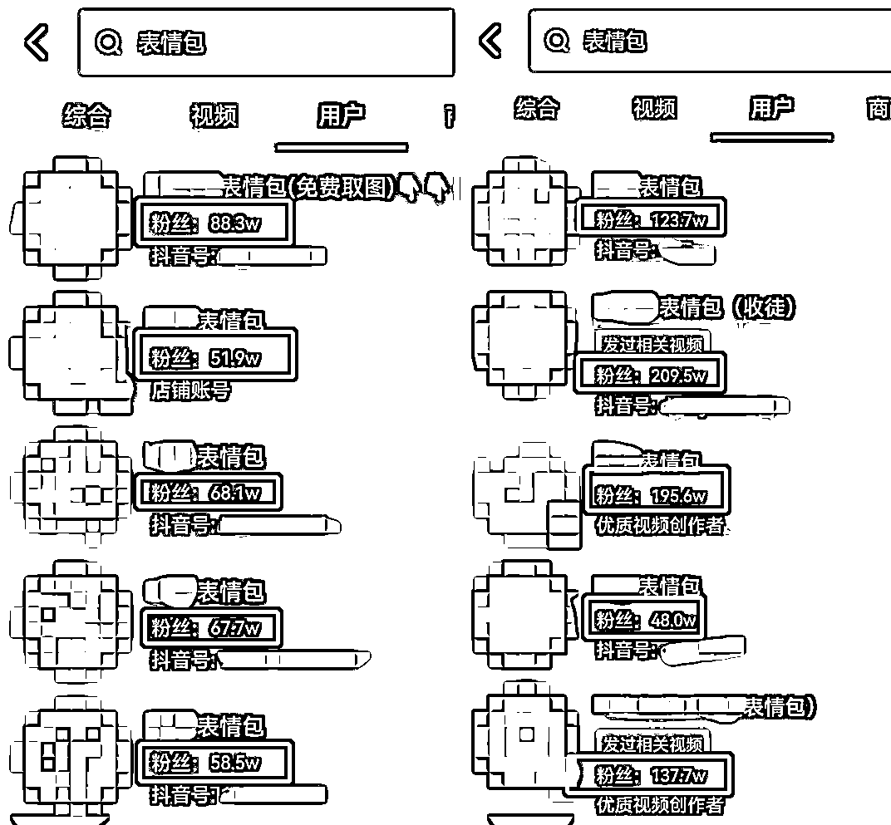

# 抖音表情包引流玩法拆解

> 原文：[`www.yuque.com/for_lazy/xkrm14/yt5yohs2p2f3i261`](https://www.yuque.com/for_lazy/xkrm14/yt5yohs2p2f3i261)

作者： 霸气哥 

日期：2023-01-30 

点赞数：12 

【表情包引 L 玩法拆解】 表情包相信大家都用过，不仅可以通过表情包进行交流，活跃气氛不尴尬，如今一言不合就斗图的环境下，受众群体相当广泛。当然，也有小伙伴嗅到其中的生意之道，并且每月轻松躺赚 5w+。 今天我们就从表情包这一介质，拆解短视频表情包玩法。 表情包项目玩法的核心，是通过在短视频平台上发布有趣的表情包视频吸引用户，再把流量导流到 V、公呺变现。 首先，我们可以找到该玩法的头部玩家，其效果大家有目共睹。 其次，我们可以通过以下几种方式，加入我们的引 L 路径 1、评论区 2、个人主页 3、D 音号 4、“喜欢”列表 在部署好我们的引 L 钩子之后，就可以进行下一步操作。 针对有付费意识的用户： 常见变现方式是引 L 到 V，设置 9.9 付费进群获取，也可以通过收代理费用，收徒等方式进行变现。 （有效囤积用户，利于后续更多变现环节） 针对喜欢白嫖的用户： 可以选择进驻 D 音的表情包，分享表情包的短视频，下挂链接引导用户进入获取，该操作无需用户付费，仅需要观看几十秒的视频就能获取。 （抓住这部分贪便宜用户的心理，虽然无法直接变现，但是也增加账号的活跃以及数据） 【浅谈短视频制作方式关键点】 1、 表情包来源：V 中表情包、淘 B 购买表情包、录屏等方式，记得规避一些版权类风险。 2、 文案搭配：模仿热门视频、热门事件、热门影视台词等。 3、 BGM 设置：可参考平台近期热门音乐、网易云等榜单，也可以自行录音插入。 4、 通过剪映等工具将上述三要素相结合，可自定义文字、视频比例、转场方式等。 本次分享到此结束 想要了解更为详细的玩法以及操作流程，可以私聊交流。 

  

 

 

