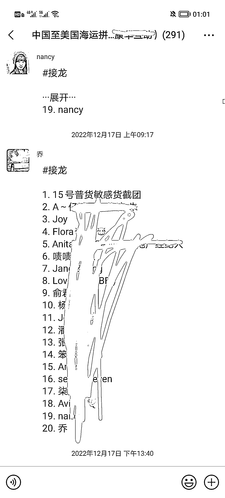
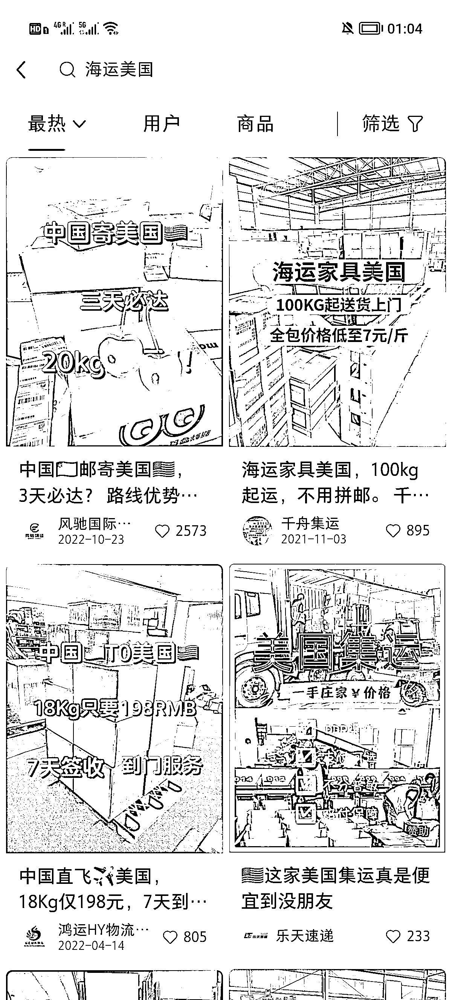
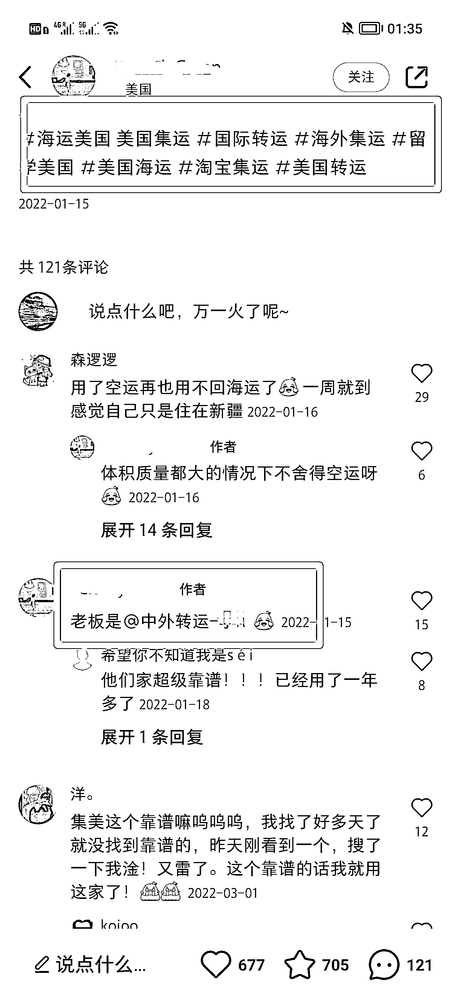

# 海外华人生意之跨境集运

> 原文：[`www.yuque.com/for_lazy/xkrm14/gdrq6m5wp4336e76`](https://www.yuque.com/for_lazy/xkrm14/gdrq6m5wp4336e76)

<ne-p id="uff7fdcb1" data-lake-id="uff7fdcb1"><ne-text id="uc911b9cb">作者： 米笠</ne-text></ne-p> <ne-p id="u50f44f8e" data-lake-id="u50f44f8e"><ne-text id="u937f9d97">日期：2023-02-03</ne-text></ne-p> <ne-p id="ucdfeae46" data-lake-id="ucdfeae46"><ne-text id="uae70871d">点赞数：</ne-text><ne-text id="u6287dd4c" ne-bold="true">39</ne-text></ne-p> <ne-hole id="u10edc025" data-lake-id="u10edc025"><ne-card data-card-name="hr" data-card-type="block" id="XUX1W" data-event-boundary="card"><ne-p id="u410c0651" data-lake-id="u410c0651"><ne-text id="u87118240">海外华人生意之一 跨境集运 因为国内的物品性价比高，样式更丰富 我本人、包括身边的小伙伴基本上每月都会从国内集运东西过来。</ne-text> <ne-text id="u1845516f">集运，就是把所有购买的产品，寄到物流方，物流方再统一发过来。 这个思路不需要你是做物流的，只要你能找到一家合作的集运公司 你可以在小红书和抖音上发作品</ne-text> <ne-text id="u2c9f6e43">赚钱从两方面 1，你的客户寄物品，集运公司给的佣金； 2，客户集中购买，一般一次几千人民币，可以在你的私域里面做淘客，赚电商佣金。</ne-text></ne-p> <ne-p id="udc3bb82e" data-lake-id="udc3bb82e"><ne-card data-card-name="image" data-card-type="inline" id="yRLmW" data-event-boundary="card"></ne-card></ne-p> <ne-p id="u77d8b9a9" data-lake-id="u77d8b9a9"><ne-card data-card-name="image" data-card-type="inline" id="m1GyY" data-event-boundary="card"></ne-card></ne-p> <ne-p id="u9d092fe9" data-lake-id="u9d092fe9"><ne-card data-card-name="image" data-card-type="inline" id="Uvkba" data-event-boundary="card"></ne-card></ne-p> <ne-hole id="u36fefd40" data-lake-id="u36fefd40"><ne-card data-card-name="hr" data-card-type="block" id="N2NFu" data-event-boundary="card"><ne-p id="u9ef02b95" data-lake-id="u9ef02b95"><ne-text id="u57f393ff">公众号懒人找资源，懒人专属群分享</ne-text></ne-p></ne-card></ne-hole></ne-card></ne-hole>