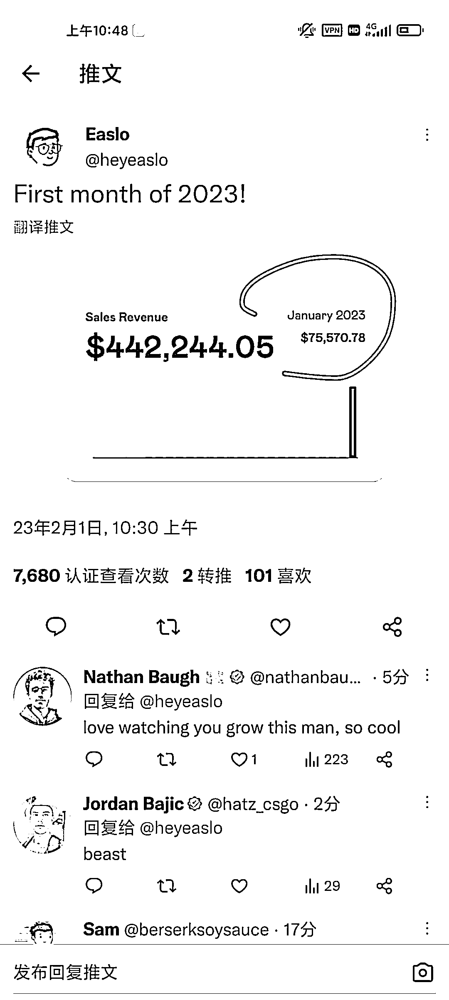

# 卖如何使用 notion 的课，月入 7 万刀

> 原文：[`www.yuque.com/for_lazy/xkrm14/pnucdgwuhyoqqaqb`](https://www.yuque.com/for_lazy/xkrm14/pnucdgwuhyoqqaqb)

<ne-p id="uce41e5a4" data-lake-id="uce41e5a4"><ne-text id="uddba9bed">作者： 壹树</ne-text></ne-p> <ne-p id="uf0cb3e77" data-lake-id="uf0cb3e77"><ne-text id="u2c4af10c">日期：2023-02-01</ne-text></ne-p> <ne-p id="u5e2ce370" data-lake-id="u5e2ce370"><ne-text id="uedbcea4e">点赞数：</ne-text><ne-text id="u2368fe4e" ne-bold="true">11</ne-text></ne-p> <ne-hole id="u859eb904" data-lake-id="u859eb904"><ne-card data-card-name="hr" data-card-type="block" id="XbH9a" data-event-boundary="card"><ne-p id="uf1aed649" data-lake-id="uf1aed649"><ne-text id="ub67a076d">notion 平台藏着不少机会，也有不少通过 api 做成小产品的，而这小伙只卖模板和教人如何使用 notion 的课，关键是他才 20 岁[发呆]，1</ne-text> <ne-text id="u0c39e7d9">月份收了 7 万多刀。</ne-text> [<ne-text id="u76166c90">https://twitter.com/heyeaslo/status/16206105188085...</ne-text>](https://twitter.com/heyeaslo/status/1620610518808514561?t=29DFaZKzducCjAlHMMbkig&s=19)</ne-p> <ne-p id="u1752b5c5" data-lake-id="u1752b5c5"><ne-card data-card-name="image" data-card-type="inline" id="qB5NB" data-event-boundary="card">  <ne-hole id="ue048572a" data-lake-id="ue048572a"><ne-card data-card-name="hr" data-card-type="block" id="XbjaZ" data-event-boundary="card"><ne-p id="u358079e1" data-lake-id="u358079e1"><ne-text id="u93ab9714">公众号懒人找资源，懒人专属群分享</ne-text></ne-p></ne-card></ne-hole></ne-card></ne-p></ne-card></ne-hole>