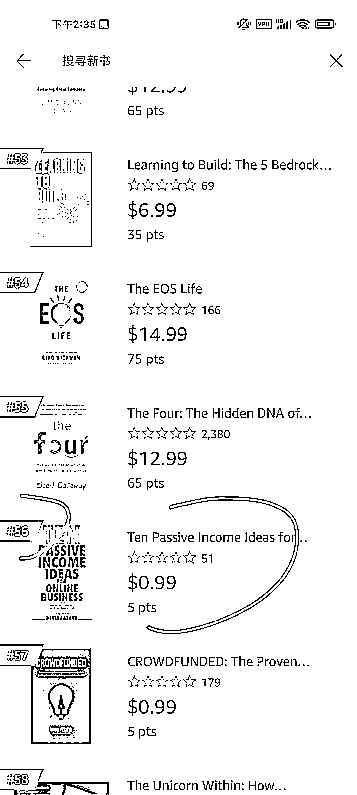

# 赚美元书籍推荐

> 原文：[`www.yuque.com/for_lazy/xkrm14/id2l2xyvsczugg5y`](https://www.yuque.com/for_lazy/xkrm14/id2l2xyvsczugg5y)

<ne-p id="udae3563f" data-lake-id="udae3563f"><ne-text id="u6456d4c6">作者： 壹树</ne-text></ne-p> <ne-p id="ud4d5d7a6" data-lake-id="ud4d5d7a6"><ne-text id="u4774ad30">日期：2023-01-31</ne-text></ne-p> <ne-p id="ue4df8621" data-lake-id="ue4df8621"><ne-text id="ua8f011f2">点赞数：</ne-text><ne-text id="ud115fb80" ne-bold="true">16</ne-text></ne-p> <ne-hole id="u325e2860" data-lake-id="u325e2860"><ne-card data-card-name="hr" data-card-type="block" id="sttK7" data-event-boundary="card"><ne-p id="u74ef94c3" data-lake-id="u74ef94c3"><ne-text id="u24a3186e">入门级的赚美刀？看看这入门书，在 amz 创业类排 56 位，0.99 刀，买来开开眼也赚了。</ne-text></ne-p> <ne-p id="u60ff5c41" data-lake-id="u60ff5c41"><ne-card data-card-name="image" data-card-type="inline" id="T2SCb" data-event-boundary="card">  <ne-p id="ub99db267" data-lake-id="ub99db267"><ne-card data-card-name="image" data-card-type="inline" id="w0Iw8" data-event-boundary="card">  <ne-p id="uf3fdff2f" data-lake-id="uf3fdff2f"><ne-card data-card-name="image" data-card-type="inline" id="KOz6S" data-event-boundary="card">  <ne-hole id="u7c4fea2a" data-lake-id="u7c4fea2a"><ne-card data-card-name="hr" data-card-type="block" id="Mt6RE" data-event-boundary="card"><ne-p id="ud70bb4ef" data-lake-id="ud70bb4ef"><ne-text id="uc64c819d">公众号懒人找资源，懒人专属群分享</ne-text></ne-p></ne-card></ne-hole></ne-card></ne-p></ne-card></ne-p></ne-card></ne-p></ne-card></ne-hole>