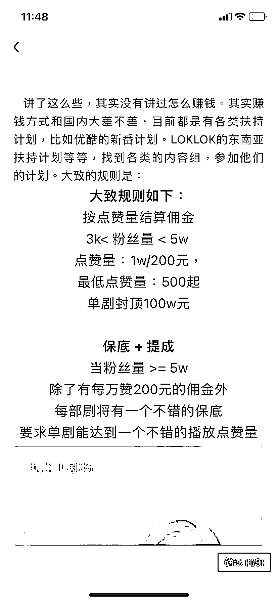
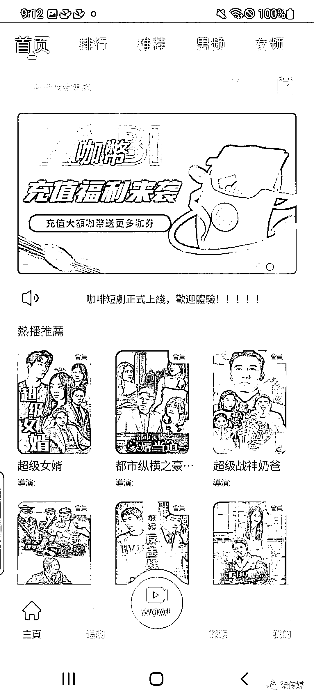

# 中国短剧出海，做海外市场

> 原文：[`www.yuque.com/for_lazy/xkrm14/kc9sik8sgzrsfi85`](https://www.yuque.com/for_lazy/xkrm14/kc9sik8sgzrsfi85)

<ne-p id="u42295b28" data-lake-id="u42295b28"><ne-text id="uc4f389f2">作者： 精准侠</ne-text></ne-p> <ne-p id="u23177999" data-lake-id="u23177999"><ne-text id="u18164fc9">日期：2023-01-30</ne-text></ne-p> <ne-p id="u5bcd6d89" data-lake-id="u5bcd6d89"><ne-text id="u14049f5d">点赞数：</ne-text><ne-text id="udf27d4b4" ne-bold="true">12</ne-text></ne-p> <ne-hole id="u69096f45" data-lake-id="u69096f45"><ne-card data-card-name="hr" data-card-type="block" id="Jd0UR" data-event-boundary="card"><ne-p id="u305c7bce" data-lake-id="u305c7bce"><ne-text id="u50c17e2a">中国短剧已经开始有第一批人出海了 （google play）上面已经有上架的出海短剧 APP 目前有三款 分别是：咖</ne-text><ne-text id="u70fd52ac" ne-italic="true">短剧，爽</ne-text><ne-text id="ucfeac02a">TV 和 TT 短*</ne-text> <ne-text id="u650cd0f6">。这几款 APP 是刚上架，不属于国内大平台的短剧 APP。 上架地区台湾东南亚，先简体转繁体 未来随着翻译，会覆盖到更多的国家</ne-text></ne-p> <ne-p id="u635041ee" data-lake-id="u635041ee"><ne-card data-card-name="image" data-card-type="inline" id="dXFY5" data-event-boundary="card"></ne-card></ne-p> <ne-p id="ue03666fb" data-lake-id="ue03666fb"><ne-card data-card-name="image" data-card-type="inline" id="qgn7c" data-event-boundary="card"></ne-card></ne-p> <ne-p id="u7dae9bf7" data-lake-id="u7dae9bf7"><ne-card data-card-name="image" data-card-type="inline" id="ezpda" data-event-boundary="card"></ne-card></ne-p> <ne-hole id="ude0af382" data-lake-id="ude0af382"><ne-card data-card-name="hr" data-card-type="block" id="ZTha3" data-event-boundary="card"><ne-p id="uadaa2ce4" data-lake-id="uadaa2ce4"><ne-text id="u58a6f5b1">公众号懒人找资源，懒人专属群分享</ne-text></ne-p></ne-card></ne-hole></ne-card></ne-hole>