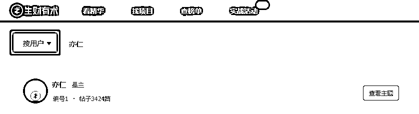
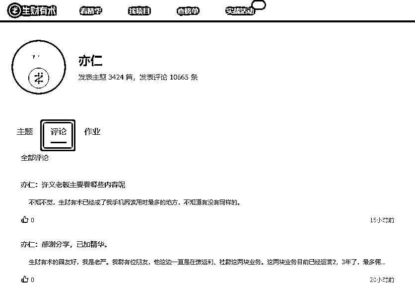

# 生财有术·精华帖索引工具 2.0 使用指南

> 原文：[`www.yuque.com/for_lazy/xkrm14/vmzg112td6fp0hsw`](https://www.yuque.com/for_lazy/xkrm14/vmzg112td6fp0hsw)

<ne-p id="uc9139b1e" data-lake-id="uc9139b1e"><ne-text id="uef89a9a8">作者： 向上的塔皮</ne-text></ne-p> <ne-p id="ufa5ba355" data-lake-id="ufa5ba355"><ne-text id="ua1b20bec">日期：2023-02-02</ne-text></ne-p> <ne-p id="ufcbffd5d" data-lake-id="ufcbffd5d"><ne-text id="u95651e27">点赞数：</ne-text><ne-text id="ubfaad540" ne-bold="true">11</ne-text></ne-p> <ne-hole id="ufbdb9a8e" data-lake-id="ufbdb9a8e"><ne-card data-card-name="hr" data-card-type="block" id="u2PGN" data-event-boundary="card"><ne-p id="udc8d65ea" data-lake-id="udc8d65ea"><ne-text id="u559763b5">这肯定是 ！！</ne-text> <ne-text id="ua1ee4444">不知道这个功能出多久了，刚发现生财有术·精华帖索引工具 2.0，选择“搜用户”，多了一个“评论”。追大佬的生财粉可以看起来了（尤其是很久没发贴的大佬）。</ne-text> <ne-text id="u8cf5460b">1\. 学习大佬的成长路径。 2\. 学习大佬的关注点。 3\. 学习大佬的思维方式。 4\. 学习大佬的给的点子，建议。 5\. 学习大佬对项目的观点。</ne-text> <ne-text id="uf9776cba">6\. 学习大佬的喜好。 7\. 学习大佬的说话方式。 ... 不知道看哪个大佬怎么办？</ne-text> <ne-text id="uabd151a2">还是在生财有术·精华帖索引工具 2.0，在“全部帖子”选择仅看精华，（或按星球栏止，或按平台）有兴趣的就直接点击头像，选择“评论”。</ne-text> <ne-text id="u193894a0">不知道中不中标，反正我已经很激动了。[偷笑]</ne-text></ne-p> <ne-p id="ud6cf4236" data-lake-id="ud6cf4236"><ne-card data-card-name="image" data-card-type="inline" id="PJoZL" data-event-boundary="card">  <ne-p id="u4a810509" data-lake-id="u4a810509"><ne-card data-card-name="image" data-card-type="inline" id="DP9x8" data-event-boundary="card">  <ne-p id="u6731febb" data-lake-id="u6731febb"><ne-card data-card-name="image" data-card-type="inline" id="VlXYm" data-event-boundary="card">  <ne-hole id="u5dad515f" data-lake-id="u5dad515f"><ne-card data-card-name="hr" data-card-type="block" id="bgXSH" data-event-boundary="card"><ne-p id="u96f67982" data-lake-id="u96f67982"><ne-text id="ubd029bcf">公众号懒人找资源，懒人专属群分享</ne-text></ne-p></ne-card></ne-hole></ne-card></ne-p></ne-card></ne-p></ne-card></ne-p></ne-card></ne-hole>