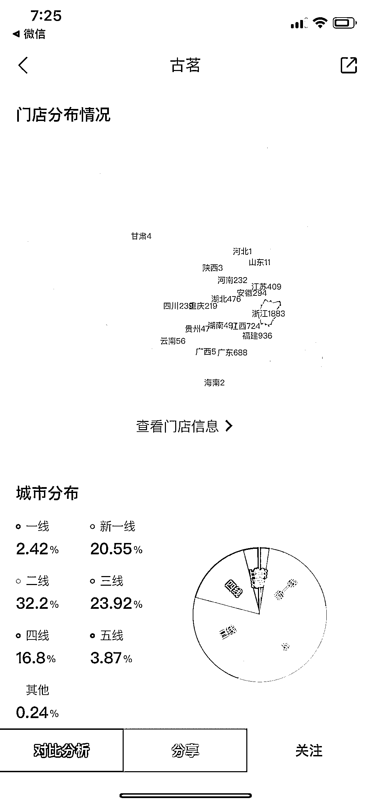
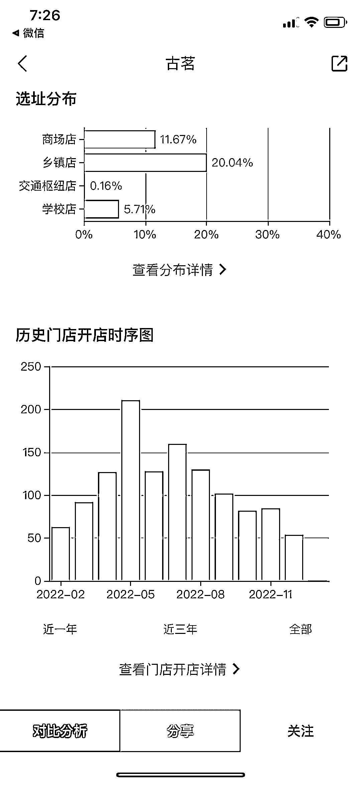

# “窄门餐眼”，餐饮行业数据一网打尽

> 原文：[`www.yuque.com/for_lazy/xkrm14/mb3rp8651gqs3bsb`](https://www.yuque.com/for_lazy/xkrm14/mb3rp8651gqs3bsb)

作者： 九京 

日期：2023-01-31 

点赞数：33 

今天出门聊天，业内大佬分享的数据软件：“窄门餐眼”，餐饮行业数据一网打尽，包括开店数量、平均客单价、选址分布等关键数据，适合餐饮相关圈友做决策使用 

 

 

 

 

