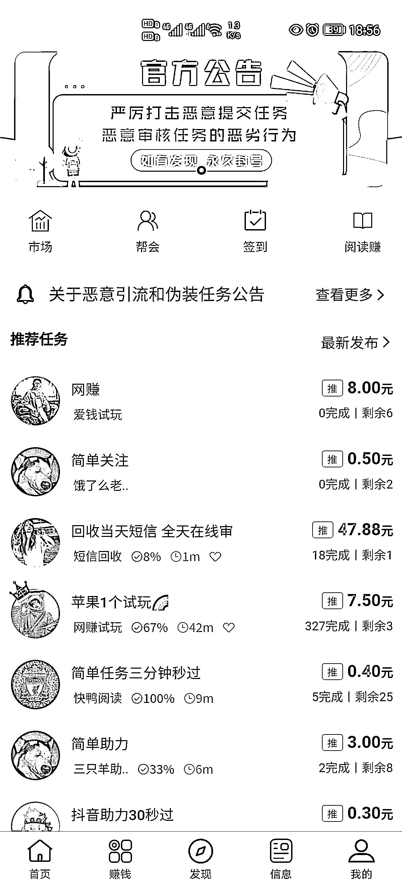
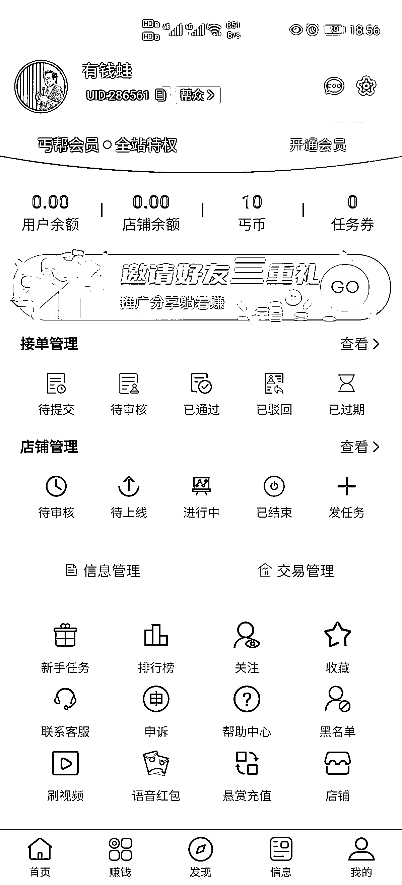
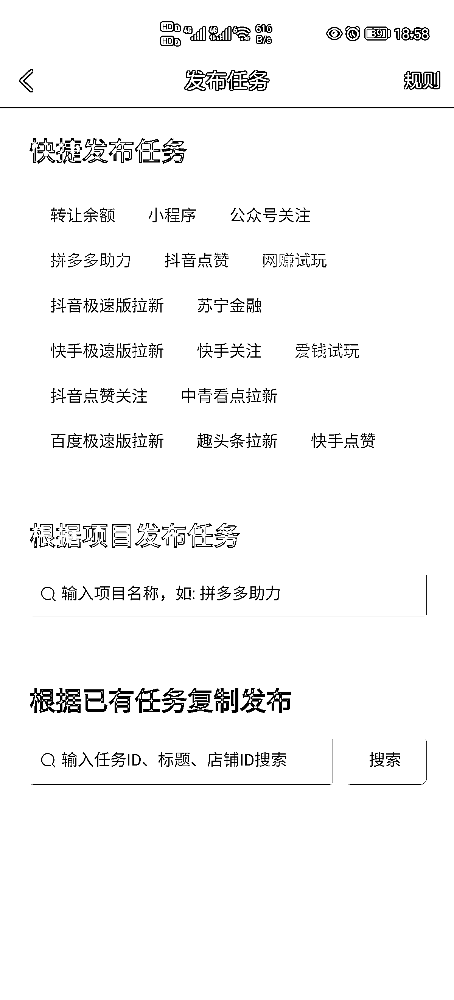

# 做任务，放单的平台“丐帮 app”

> 原文：[`www.yuque.com/for_lazy/xkrm14/kf2axudgn2skb807`](https://www.yuque.com/for_lazy/xkrm14/kf2axudgn2skb807)

作者： 小川 

日期：2023-01-31 

点赞数：36 

1.做任务，放单的平台“丐帮 app” 2.使用场景： ①给你的公众号刷 500 个搜索定向关注，可以提高你的公众号搜索排名。 ②给你的抖音作品搜索完播然后点赞，提高你的抖音作品的搜索排名。 ③APP 拉新搜索关注评论等等，都能刷，这些都是真人。 3.下载地址：[星帮](https://xxreg.yubeijun.com/#/pages/invite?inviteCode=2IWQ8U) 

 

 

 

