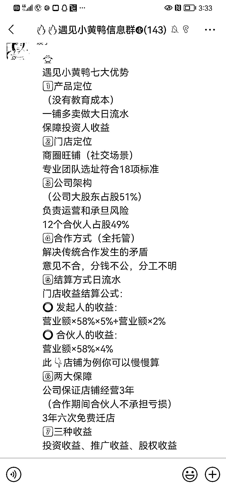

# 遇见小黄鸭商业模式设计

> 原文：[`www.yuque.com/for_lazy/xkrm14/ewdrrlsuoi2srtyy`](https://www.yuque.com/for_lazy/xkrm14/ewdrrlsuoi2srtyy)

<ne-p id="ufbb9b1fe" data-lake-id="ufbb9b1fe"><ne-text id="ubd4082ca">作者： 宋东波-进击 2030</ne-text></ne-p> <ne-p id="u19662c18" data-lake-id="u19662c18"><ne-text id="u5b5a489f">日期：2023-01-31</ne-text></ne-p> <ne-p id="ud89ff2ea" data-lake-id="ud89ff2ea"><ne-text id="uce1a30bd">点赞数：</ne-text><ne-text id="ufdb4d2b7" ne-bold="true">18</ne-text></ne-p> <ne-hole id="u5ce21f66" data-lake-id="u5ce21f66"><ne-card data-card-name="hr" data-card-type="block" id="pilg9" data-event-boundary="card"><ne-p id="u636c4ef8" data-lake-id="u636c4ef8"><ne-text id="u1852fcf3">遇见小黄鸭甩手掌柜及时分钱的商业模式设计，线下拓新店速度确实 yyds。</ne-text></ne-p> <ne-p id="u6b95a4da" data-lake-id="u6b95a4da"><ne-card data-card-name="image" data-card-type="inline" id="DAWSD" data-event-boundary="card"></ne-card></ne-p> <ne-p id="u1903cc48" data-lake-id="u1903cc48"><ne-card data-card-name="image" data-card-type="inline" id="sXtg8" data-event-boundary="card">  <ne-p id="u3bf858ce" data-lake-id="u3bf858ce"><ne-card data-card-name="image" data-card-type="inline" id="otjgD" data-event-boundary="card"></ne-card></ne-p> <ne-hole id="u0ab72909" data-lake-id="u0ab72909"><ne-card data-card-name="hr" data-card-type="block" id="JbUr8" data-event-boundary="card"><ne-p id="u5ea4aa5f" data-lake-id="u5ea4aa5f"><ne-text id="u62c30707">公众号懒人找资源，懒人专属群分享</ne-text></ne-p></ne-card></ne-hole></ne-card></ne-p></ne-card></ne-hole>